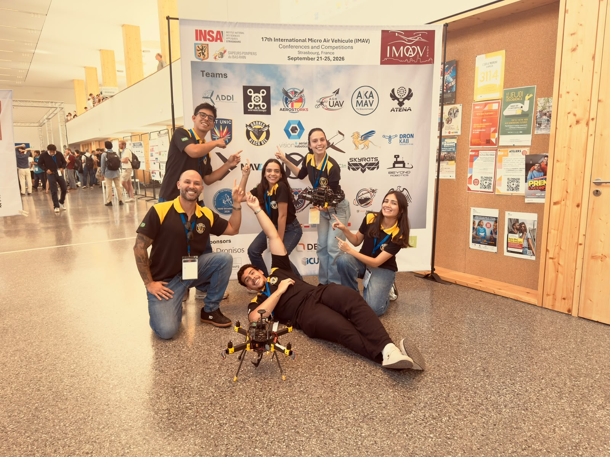
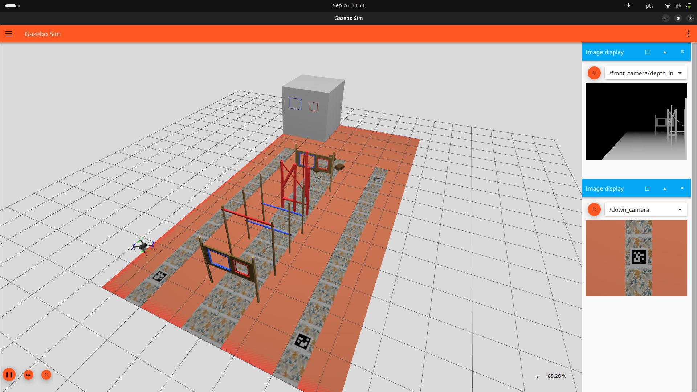

<p align="center">

| 🇧🇷 [Português](README.md) | 🇺🇸 [English](README-EN.md) |
|:---:|:---:|

</p>

# IMAV 2026

ROS 2 mission software for the IMAV 2026 indoor and outdoor competitions. This repository contains two Python packages: `indoor` and `manequim` (the outdoor first-aid delivery mission).

<div align="center">
  
</div>

## Competition Rules

The official reference included with this repository is [Rulebook_IMAV2026_v5.pdf](Rulebook_IMAV2026_v5.pdf). Read it before testing or flying: it defines the competition field, task procedures, scoring, and safety requirements. The software is an implementation aid, not a substitute for the rules or the required safety checks.

The current code covers selected tasks, not every task in the rule book:

- **Indoor:** obstacle course, dark-room inspection, hot-spot package drop, and precision landing behavior.
- **Outdoor:** search for a mannequin and deliver a first-aid package, corresponding to Outdoor Mission 4 (the mannequin has a “dead man” device).

The rule book also describes other indoor and outdoor missions that are not represented by these state machines.

## Technologies

- **ROS 2 / `rclpy`:** mission nodes, package discovery, launch files, and ROS image topics.
- **YASMIN:** hierarchical state machines and blackboards for mission sequencing and transitions.
- **Nectar SDK:** drone control, MAVLink integration, camera/vision sources, and detection interfaces used by the mission states.
- **ArduPilot SITL and Gazebo Sim:** software-in-the-loop flight testing; the indoor package includes a custom Gazebo arena and Nectar launch integration.
- **Computer vision:** learned object detectors for gates, bars, people, babies, and drop targets; camera/depth data and ArUco markers are also used by indoor navigation and landing states.

## Repository Layout

```text
indoor/
	indoor/indoor_sm.py          Top-level indoor mission state machine
	indoor/missions/             Obstacle, inspect, drop, and landing submachines
	indoor/states/               Reusable mission and flight states
	indoor/config.py             Mission parameters, presets, and CLI configuration
	indoor/presets.py            Named configurations
	launch/                      Mission and Gazebo/SITL launch files
	simulation/                  Indoor arena SDF and Gazebo models
	share/models/                Detector model files

manequim/
	manequim/mangalarga.py       Outdoor ROS 2 node and top-level state machine
	manequim/searchSM/           Search, navigation, and mannequin detection
	manequim/packageSM/          Approach, align, and release the package
	manequim/core/               Initialization, takeoff, return-to-launch, cleanup
	Simulation/world/            Gazebo outdoor world SDF files
	Simulation/models/            Local firefighter model
```

Both packages use the `ament_python` build type and expose a console executable named `mangalarga`; select the ROS package name when running it.

## Setup and Build

Use a ROS 2 environment with `colcon` and the Nectar SDK installed and sourced. The `nectar` Python/ROS dependencies are supplied by that environment rather than vendored in this repository.

```bash
cd ~/ros2_ws
source /opt/ros/$ROS_DISTRO/setup.bash
colcon build --packages-select indoor manequim --symlink-install
source install/setup.bash
```

For the indoor SITL workflow, activate the Nectar environment as described in [the indoor simulation notes](indoor/simulation/README.md). Those notes include the expected SITL bridge, topics, and a scenery-only Gazebo check.

## Indoor Mission

The indoor top-level machine initializes the drone, takes off, then runs the obstacle, room-inspection, and hot-spot drop submachines before the configured precision-landing/landing behavior. Options and detector/control parameters are collected in `indoor/config.py`; named configurations live in `indoor/presets.py`.

Run the mission node directly:

```bash
ros2 run indoor mangalarga --help
ros2 run indoor mangalarga --sitl --preset JORGE
```

Use any preset listed by the package, or start the interactive configuration wizard with `--preset custom`. Stage skips are available with `--obstacle-skip`, `--inspect-skip`, `--droping-skip`, and `--precise-skip`; `--no-takeoff` is intended for controlled workflows where takeoff is handled separately. Review the selected settings before flight.

The package also has mission-node launch entry points:

```bash
ros2 launch indoor mangalarga.launch.py
ros2 launch indoor simulation.launch.py
```

These launch files start the **mission node**; they do not start Gazebo. There is a current argument mismatch: the wrappers pass `--config`, while the node accepts `--preset`, so `config:=...` does not select a preset. Use `ros2 run` to choose a preset until the wrappers are aligned. To bring up the indoor world and SITL, follow the full terminal-by-terminal procedure in [indoor/simulation/README.md](indoor/simulation/README.md). Its main Gazebo launch command is:

```bash
ros2 launch indoor sitl_gazebo.launch.py
```

<div align="center">
  
</div>

## Outdoor Mannequin Mission

The outdoor state machine initializes and takes off, searches for the target mannequin, then runs the package-delivery sequence: descend, align, release, and return to launch. Search and delivery states are separated under `searchSM/` and `packageSM/` so their navigation and retry behavior can be developed independently.

Run it after the outdoor vehicle connection and camera/detector environment are ready:

```bash
ros2 run manequim mangalarga --help
ros2 run manequim mangalarga --manequim-number 1
```

`--manequim-number` selects the target index (1–3). Optionally pass both `--latitude LATITUDE --longitude LONGITUDE` to set the initial search coordinate. The detector model can be selected with `MANEQUIM_DETECTOR_MODEL`; otherwise the current simulation configuration expects `~/ros2_ws/yolo26n.pt`.

### Outdoor Simulation Status

The outdoor package contains Gazebo world files under `manequim/Simulation/world/` and a local firefighter model, but it does not currently provide an outdoor ROS 2 launch file or a documented end-to-end SITL bring-up. `world_test.sdf` also references Gazebo resources such as `outdoor_field_scenery` and `iris_with_gimbal` that must be available from the Nectar/ArduPilot simulation environment. Once the appropriate SITL and model resource paths are running, start the mission node with `ros2 run manequim mangalarga ...` as above.

The current outdoor configuration sets `SIM_MODE = True` in `manequim/core/constants.py`. Treat it as simulation-oriented: do not assume the package is ready for real outdoor flight without reviewing and configuring its connection, camera, detector, and safety parameters. The helper `manequim/Simulation/script/random_base_location.py` additionally relies on a separate mapping package and local workspace paths, so it is not a self-contained world-generation command.

> **Image placeholder:** Add a Gazebo view of the outdoor field with the target mannequins and delivery area. Replace this note with an image when available.

## Development and Visualization

The outdoor node publishes its state-machine visualization as `MANGALARGA_FSM`; the YASMIN viewer can be used to inspect state transitions while running. For quick indoor arena geometry checks without SITL, use the scenery-only command in the indoor simulation notes. For flight simulation, start the simulator/bridge first and launch the corresponding mission node in a separate terminal.

After code changes, rebuild the affected package with `colcon build --packages-select indoor` or `colcon build --packages-select manequim`, then source `install/setup.bash` again.
