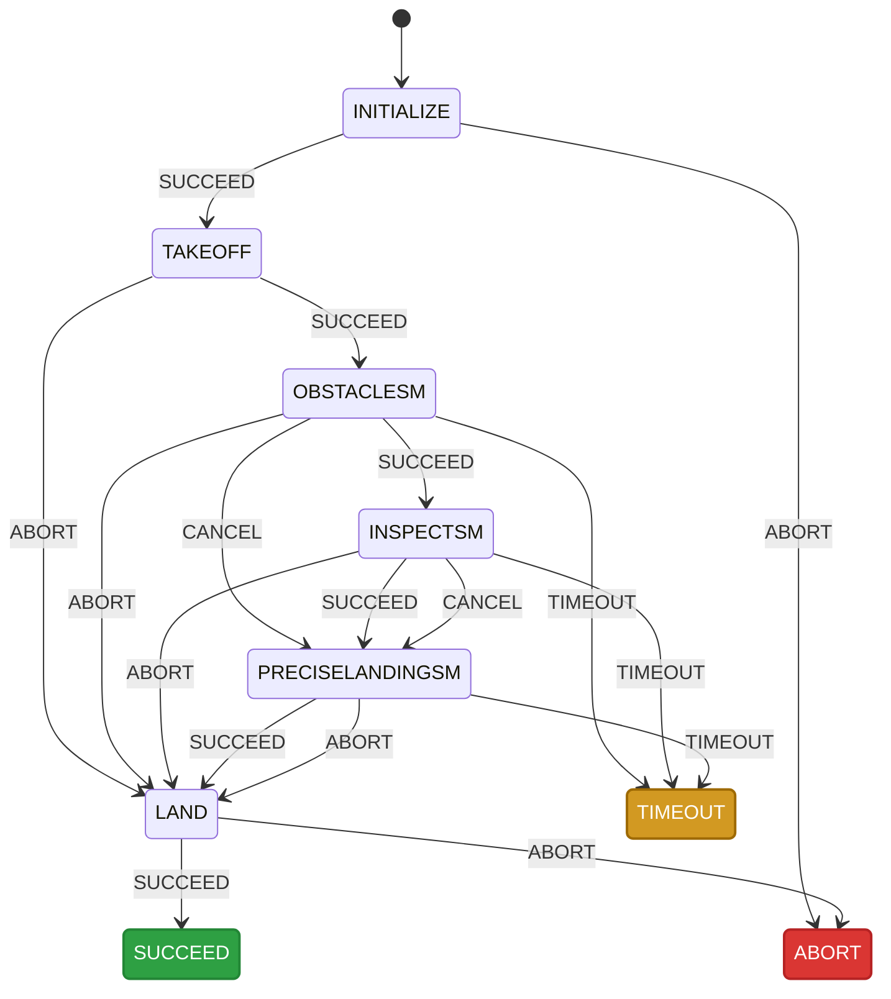
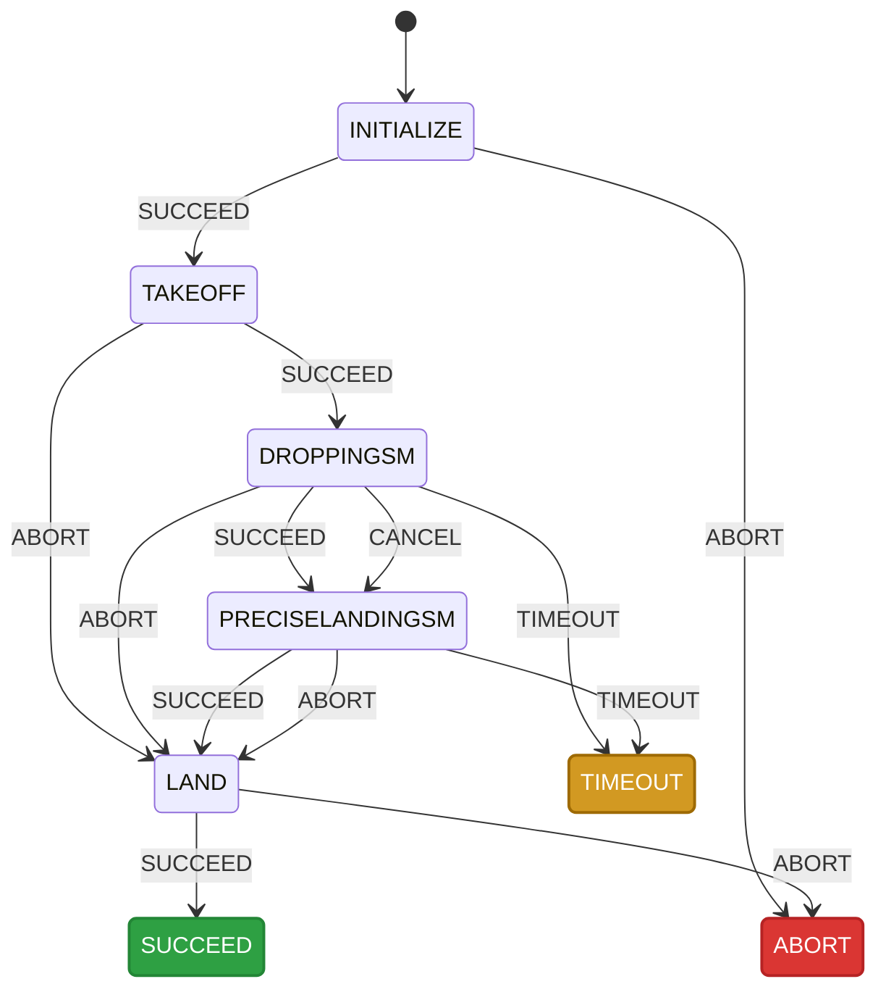
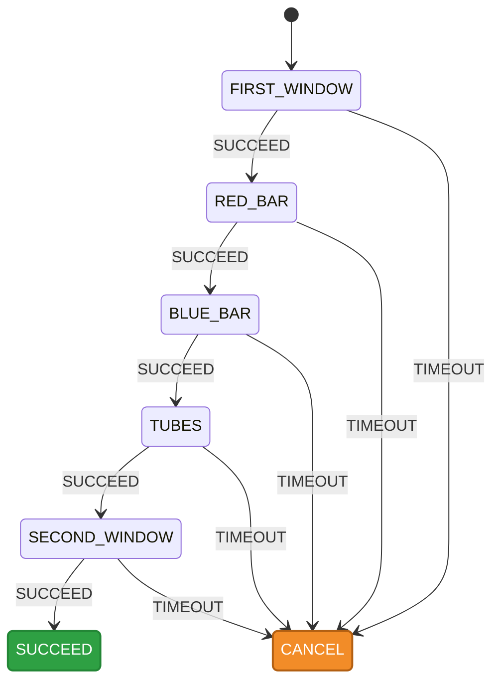
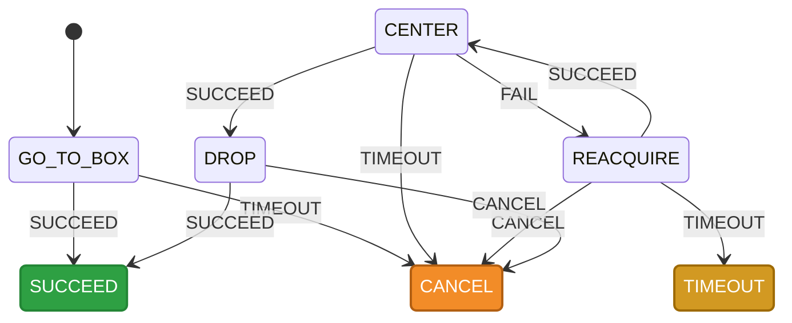
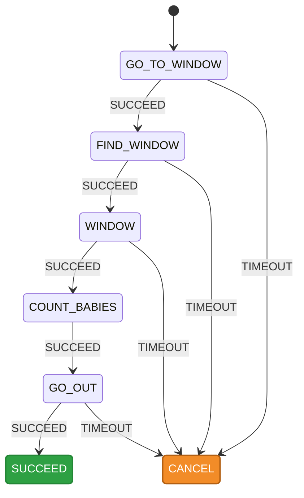
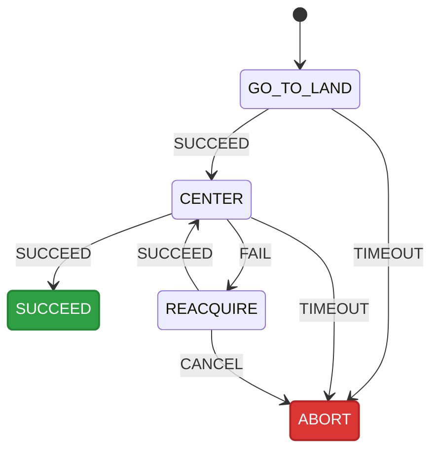

# IMAV 2026

## Indoor State Machine

The `IndoorSM` is the main orchestrator for the IMAV 2026 Indoor Competition. Instead of being a hardcoded sequence of events, this state machine is **dynamically configurable**. 

You can pass any combination of mission tasks into the `config.missions` array. The state machine will automatically link them together, ensuring that upon `SUCCEED`, the drone progresses to the next configured task. If a task is `CANCEL`led, the drone will automatically attempt a precise landing. 

For the competition, we are deploying two drones with distinct mission configurations. 

### 1. First Drone: Obstacle & Inspection Mission
**Configuration:** `['OBSTACLESM', 'INSPECTSM', 'PRECISELANDINGSM']`

Drone 1 is tasked with navigating the obstacle course and inspecting the designated room before returning for a precise landing.

---

### 2. Second Drone: Payload Drop Mission

**Configuration:** `['DROPPINGSM', 'PRECISELANDINGSM']`

Drone 2 bypasses the obstacles and focuses entirely on navigating to the target zone to drop the payload before initiating its precise landing sequence.

## Obstacle State Machine (Mission 1)

## Dropping State Machine (Mission 2)

## Inspect State Machine (Mission 3)

## Precise Landing
