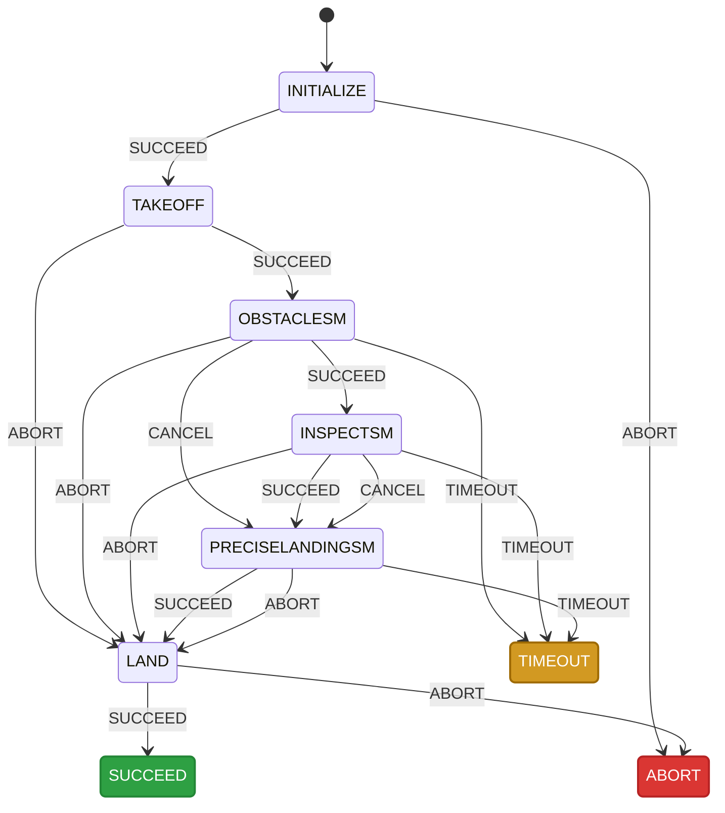
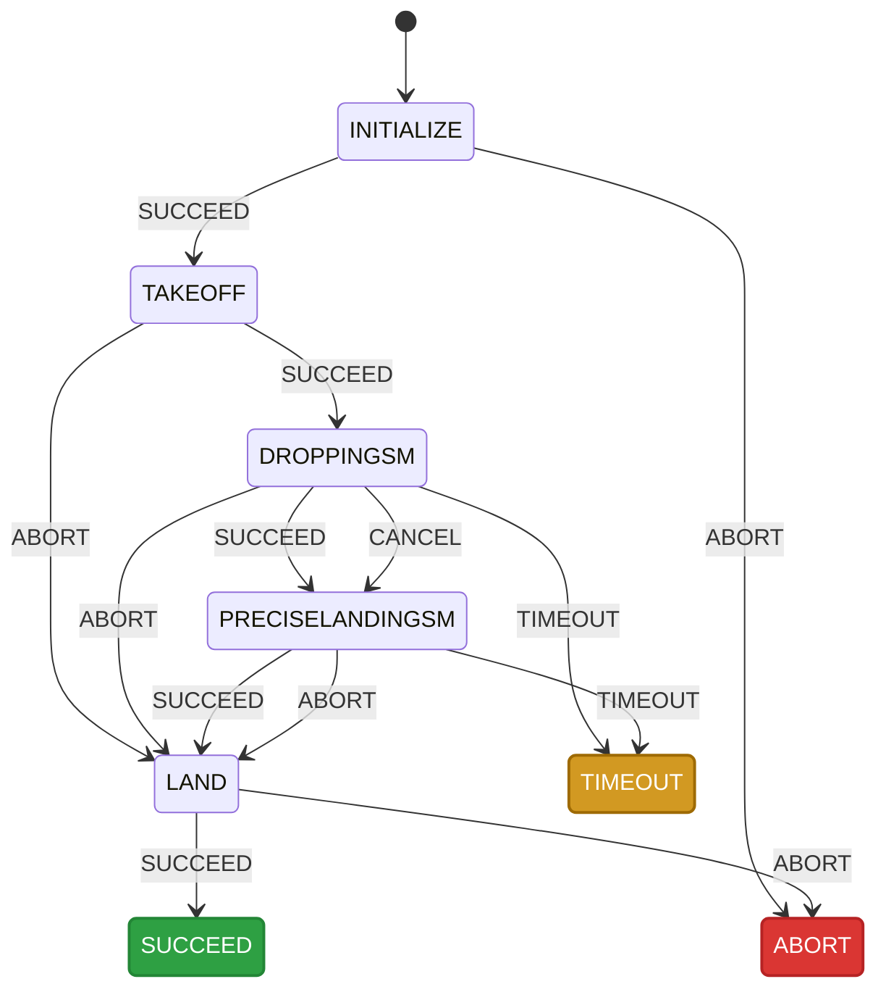
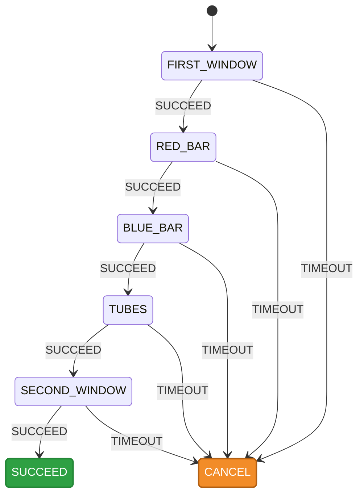
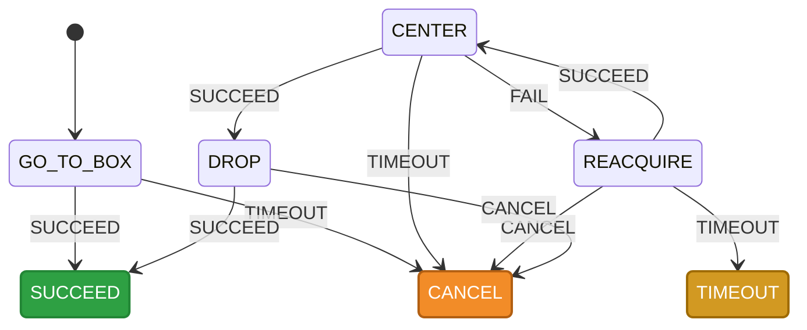
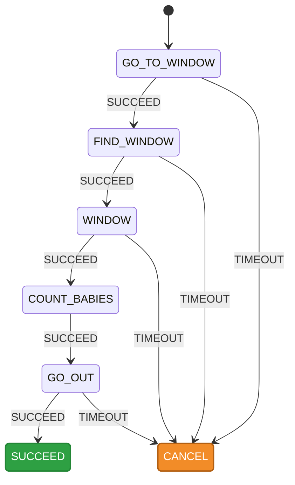
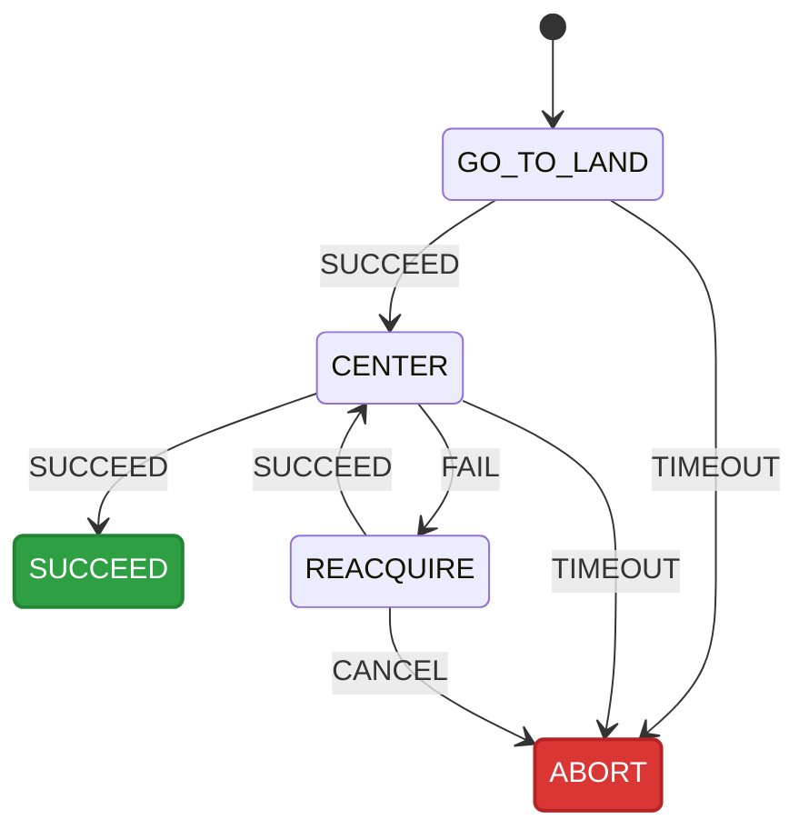

# IMAV 2026


## Running Missions

The system uses configuration profiles to switch seamlessly between physical flights and simulation, as well as between different drone mission loadouts.

### Configuration Profiles

The state machine accepts a `--config` parameter to load specific mission arrays and connection strings. These are defined in `config.py`.

* **Physical Drone Profiles (UDP Connection):**
* `default`: Runs all 4 missions in sequence. Connects via `udp:127.0.0.1:14551`.
* `cleitinho`: Runs Mission 1 (Obstacles) & Mission 3 (Inspect) + Landing.
* `jorge`: Runs Mission 2 (Dropping) + Landing.


* **Simulation Profiles (TCP Connection):**
* `sitl`: The simulation equivalent of `default`. Connects via `tcp:127.0.0.1:5762`.
* `sitl_cleitinho`: Simulation equivalent for Cleitinho.
* `sitl_jorge`: Simulation equivalent for Jorge.


### Launch Files

The package includes several launch files to spin up the environment and state machines.

* `sitl_gazebo.launch.py`: Launches the Nectar ArduPilot SITL and Gazebo indoor simulation environment. It includes the IMAV 2026 scenery and spawns the drone before the first gate.
* `mangalarga.launch.py`: Launches the state machine node. It defaults to the `default` configuration profile but can be overridden. Best used for real-world flights.
* `simulation.launch.py`: Identical to `mangalarga.launch.py`, but it defaults to the `sitl` configuration profile. Best used when running against Gazebo.

### How to Run

#### 1. Running in Simulation (SITL)
For a detailed explanation of the simulation launch parameters and Gazebo setup, please refer to the [Simulation Launch Guide](indoor/simulation/README.md).

#### 2. Running on the Physical Drone

For physical flights, you only need to run the state machine launch file (assuming your camera/sensor nodes are launched separately or via a master launch file).

```bash
ros2 launch indoor mangalarga.launch.py config:=cleitinho
```

#### 3. Running via `ros2 run`

If you want to run the python script directly without the launch files, you can use the `--config` flag:

```bash
# Physical drone
ros2 run indoor mangalarga --config jorge

# Simulated drone
ros2 run indoor mangalarga --config sitl_jorge
```

## Yasmin Blackboard Summary


| Blackboard Key | Object Type | Description |
| --- | --- | --- |
| **`start_time`** | `rclpy.time.Time` | The timestamp generated right when the `Initialize` state begins execution. |
| **`drone`** | `Drone` (Mavros or Mavlink) | The primary drone control object instantiated via the `DroneFactory`. |
| **`pid_x`** | `PIDController` | The configured PID controller handling X-axis movements. |
| **`pid_y`** | `PIDController` | The configured PID controller handling Y-axis movements. |
| **`pid_z`** | `PIDController` | The configured PID controller handling altitude/Z-axis movements. |
| **`pid_yaw`** | `PIDController` | The configured PID controller handling the drone's rotation (yaw). |
| **`detector_gate`** | `Detector` | The AI model loaded specifically to detect gates. |
| **`callback_detector_gate`** | `method` | The callback function that runs gate detection and saves timestamped raw/annotated images to the `~/ros2_ws/` directory. |
| **`detector_baby`** | `Detector` | The AI model loaded specifically to detect babies (for the indoor inspection mission). |
| **`callback_detector_baby`** | `method` | The callback function that runs baby detection and logs the images. |
| **`detector_box`** | `Detector` | The AI model loaded specifically to detect boxes/drop zones. |
| **`callback_detector_box`** | `method` | The callback function that runs box detection and logs the images. |
| **`aruco`** | `Aruco` | The ArUco marker detector configured with dictionary 5 and tag size 1.0. |
| **`callback_aruco`** | `method` | The callback function that processes ArUco detection, draws bounding boxes, and logs the images. |
| **`image_handler_front`** | `ImageHandler` | The camera interface managing the front-facing camera stream. |
| **`image_handler_down`** | `ImageHandler` | The camera interface managing the downward-facing camera stream. |

## Indoor State Machine

The `IndoorSM` is the main orchestrator for the IMAV 2026 Indoor Competition. Instead of being a hardcoded sequence of events, this state machine is **dynamically configurable**. 

You can pass any combination of mission tasks into the `config.missions` array. The state machine will automatically link them together, ensuring that upon `SUCCEED`, the drone progresses to the next configured task. If a task is `CANCEL`led, the drone will automatically attempt a precise landing. 

For the competition, we are deploying two drones with distinct mission configurations. 

### CLEITINHO: Mission 1 & Mission 3
**Configuration:** `['OBSTACLESM', 'INSPECTSM', 'PRECISELANDINGSM']`

Drone 1 is tasked with navigating the obstacle course and inspecting the designated room before returning for a precise landing.



---

### JORGE: Mission 2

**Configuration:** `['DROPPINGSM', 'PRECISELANDINGSM']`

Drone 2 bypasses the obstacles and focuses entirely on navigating to the target zone to drop the payload before initiating its precise landing sequence.




## Obstacle State Machine (Mission 1)


## Dropping State Machine (Mission 2)


## Inspect State Machine (Mission 3)


## Precise Landing
