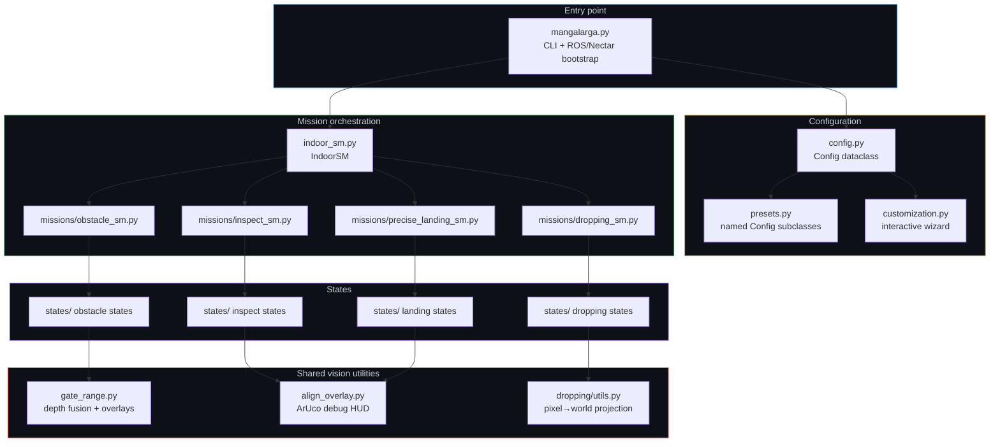
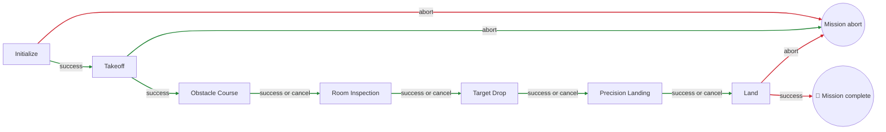
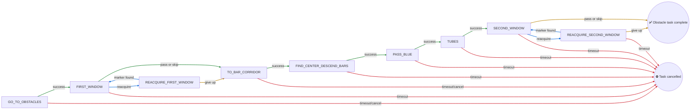
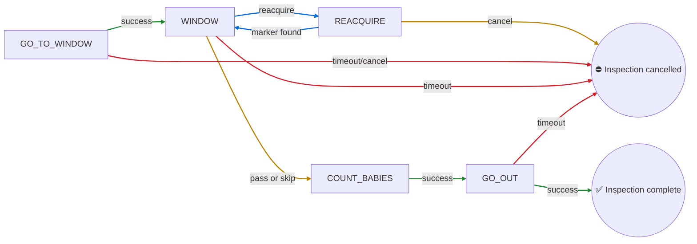
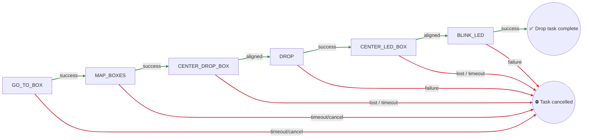
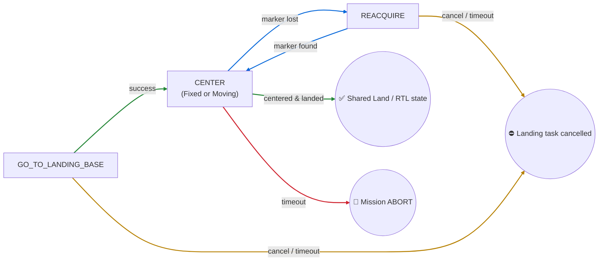
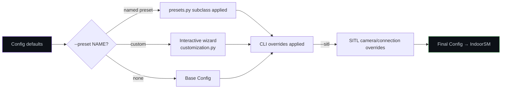

<p align="center">

| 🇧🇷 [Português](README.md) | 🇺🇸 [English](README-EN.md) |
|:---:|:---:|

</p>

# IMAV 2026 Indoor 

<p align="center">
  
</p>

The **indoor** mission package is the autonomous flight software for the IMAV 2026 Indoor competition. It flies the aircraft through four sequential tasks — **Obstacle Course → Room Inspection → Target Drop → Precision Landing** — with ROS 2 and the Nectar SDK providing vehicle/perception interfaces and **Yasmin** sequencing every mission as a hierarchical state machine.

## Table of Contents

1. [Vehicle & Software Stack](#vehicle--software-stack)
2. [Software Architecture](#software-architecture)
3. [Top-Level Mission Sequence](#top-level-mission-sequence)
4. [Mission: Obstacle Course](#mission-obstacle-course)
5. [Mission: Room Inspection](#mission-room-inspection)
6. [Mission: Target Drop](#mission-target-drop)
7. [Mission: Precision Landing](#mission-precision-landing)
8. [Shared Vision & Debug Tooling](#shared-vision--debug-tooling)
9. [Configuration & Presets](#configuration--presets)
10. [Running the Mission](#running-the-mission)

---

## Vehicle & Software Stack

### Hardware

| Component | Detail |
|---|---|
| Flight controller | Pixhawk 6C running ArduPilot |
| Onboard computer | NVIDIA Jetson Orin Nano Super |
| Front (north) camera | Intel RealSense D435i, RGB + depth, 640×480, ≈69.4°×42.5° FOV |
| Backward (south) camera | Logitech C920, 1640×1232, ≈70.4°×43.3° FOV |
| Downward camera | Arducam IMX662 / C920e, 640×640, ≈86°×47° FOV |
| Navigation | NVIDIA Isaac ROS Visual SLAM |
| Actuators | Servo-driven payload gripper, WLED-controlled status LED |

Camera topics, device indexes, offsets, and processing settings live in [`indoor/config.py`](indoor/config.py). **Verify these against the deployed camera launch and calibration before flight** — SITL uses different topics and sensor settings (see `Config.apply_args`).

### Software

| Layer | Tool |
|---|---|
| Middleware | [ROS 2](https://docs.ros.org/) |
| Flight link | [pymavlink](https://github.com/ardupilot/pymavlink) (ROS ↔ MAVLink/ArduPilot) |
| Vehicle & vision API | [Nectar SDK v1.1.0](https://github.com/Black-Bee-Drones/nectar-sdk/releases/tag/v1.1.0) |
| Mission orchestration | [Yasmin](https://github.com/uleroboticsgroup/yasmin) hierarchical state machines |
| Image processing / ArUco | [OpenCV](https://opencv.org/) |
| Object detection | [Ultralytics YOLO](https://docs.ultralytics.com/) (gate, bar, box, baby/person detectors) |
| Localization | [NVIDIA Isaac ROS Visual SLAM](https://github.com/NVIDIA-ISAAC-ROS/isaac_ros_visual_slam) |

---

## Software Architecture



### Repository layout

```
indoor/
├── mangalarga.py          # ROS 2 executable / CLI entry point
├── config.py              # Config dataclass (all tunables)
├── presets.py             # Named Config subclasses (CLEITINHO, FULL, ...)
├── customization.py       # Interactive "--preset custom" wizard
├── camera_index.py        # v4l2 device index lookup by camera name
├── indoor_sm.py           # Top-level state machine (Initialize → Land)
├── gate_range.py          # Depth fusion + gate overlay drawing (shared)
├── align_overlay.py       # ArUco alignment debug HUD (shared)
├── gate_depth_check.py    # Standalone gate/depth tuning tool (not part of the mission SM)
├── missions/
│   ├── obstacle_sm.py     # ObstacleSM
│   ├── inspect_sm.py      # InspectSM
│   ├── dropping_sm.py     # DroppingSM
│   └── precise_landing_sm.py  # PreciseLandingSM
└── states/
    ├── go_to_obstacles.py, window.py, reacquire_window.py,
    │   to_bar_corridor.py, find_center_descend_bars.py,
    │   pass_blue.py, tubes.py                     # Obstacle course
    ├── go_to_window.py, count_babies.py, go_out.py # Room inspection
    ├── go_to_box.py, map_boxes.py, center_box.py,
    │   act_box.py, utils.py                        # Target drop
    └── go_to_landing_base.py, center_fixed.py,
        center_moving.py, reacquire.py               # Precision landing
```

---

## Top-Level Mission Sequence

`IndoorSM` ([`indoor_sm.py`](indoor/indoor_sm.py)) wraps the four missions between a shared **Initialize → Takeoff** and **Land** pair.



**Key insight:** every mission sub-machine's `CANCEL` outcome is treated as "move on" at this level — an obstacle, room, or drop task that couldn't be completed does **not** stop the overall flight. Only `Initialize`, `Takeoff`, and `Land` failing (`ABORT`) end the run early. This is what makes the `*_skip` config flags and preset system (see [Configuration & Presets](#configuration--presets)) safe to use for partial test flights.

<p align="center">
  
</p>

---

## Mission: Obstacle Course

**States involved:** `GoToObstacles`, `Window`, `ReacquireWindow`, `ToBarCorridor`, `FindCenterDescendBars`, `PassBlue`, `Tubes`.



🟢 success/normal progress · 🔵 recovery/retry · 🟡 skipped or gracefully continued · 🔴 timeout/abort exits the task

### Walkthrough

1. **`GoToObstacles`** stamps the phase clock (`obstacle_start_time`) and flies three waypoints to the course entry point at gate altitude. Can be cancelled outright (`obstacle_skip`) or short-circuited to a no-op if the vehicle already took off elsewhere (`skip_takeoff`).
2. **`Window` ("first"/"second")** is the vision-servoed gate crossing: a two-phase PID loop that **aligns** on the detected gate (lateral + vertical pixel error, fused bounding-box + depth-camera range estimate), then **creeps** forward holding altitude until close enough to **commit** through with an open-loop forward burst. Losing the gate triggers `reacquire`; hitting `skip` (config) overflies without ever looking for it.
3. **`ReacquireWindow`** performs fixed lateral sweep patterns looking for `_CONFIRM` (5) consecutive re-detections before handing control back to `Window`.
4. **`ToBarCorridor`** climbs to a red-obstacle-step altitude (1/2/3, config-selected) and moves forward/laterally into the bar gap.
5. **`FindCenterDescendBars`** searches the downward camera for red/blue line markers, PID-centers on the gap midpoint (estimating the other line's position from the known bar gap if only one line is visible), then descends to a blue-obstacle-step altitude.
6. **`PassBlue`** — a short fixed forward burst clearing the now-descended bar section.
7. **`Tubes`** flies a fixed 3-leg lateral-dodge pattern to avoid the tube obstacle (a depth-based creep-to-standoff helper exists in the code but is currently commented out).

<p align="center">
  
</p>


### Key config (see [`config.py`](indoor/config.py))

| Group | Notable keys |
|---|---|
| Gate crossing | `obstacle_gate_alt`, `obstacle_gate_standoff`, `obstacle_gate_width`, `obstacle_gate_kp/kd/ki`, `obstacle_gate_lost_tolerance`, `obstacle_gate_align_only` |
| Bar corridor | `obstacle_red`, `obstacle_red_step_alt_*`, `obstacle_blue_1`, `obstacle_blue_step_alt_*`, `obstacle_bar_center_skip` |
| Tubes | `obstacle_tubes_skip`, `obstacle_tubes_x_avoid`, `obstacle_tubes_y_avoid`, `obstacle_tubes_alt` |
| Skip switches | `obstacle_skip`, `obstacle_gate_first_skip`, `obstacle_gate_second_skip`, `obstacle_after_first_skip` |

---

## Mission: Room Inspection

**States involved:** `GoToWindow`, `Window("room")`, `ReacquireWindow("room")`, `CountBabies`, `GoOut`.



### Walkthrough

1. **`GoToWindow`** flies to the inspection approach point, then descends while coarsely centering on an **ArUco marker** (not the YOLO gate detector — a distinct pixel/pose pipeline), yaws 180°, and runs a second, finer PID pass correcting X/Y/yaw before handing off.
2. **`Window("room")`** reuses the exact same gate-crossing state as the obstacle course, just pointed at the **south camera**, with no depth-camera fusion, and `inspect_gate_*`-prefixed tuning. On success it records `inspect_gate_alignment_alt` for `GoOut` to reuse.
3. **`CountBabies`** hovers and samples the downward camera `model_baby_sample_count` (default 15) times, merging overlapping person/teddy-bear detections (IOU union-find) into a single count per sample, then picks the best sample (optionally constrained to a known expected count) and saves a labeled debug image.
4. **`GoOut`** flies forward through the window by the recorded standoff+commit distance and turns off the WLED status light.

<p align="center">
  
</p>

### Key config

| Group | Notable keys |
|---|---|
| Approach | `inspect_start_x/y/z`, `inspect_descent_speed`, `aruco_marker_dict`, `inspect_aruco_size` |
| Window crossing | `inspect_gate_standoff`, `inspect_gate_creep_vx`, `inspect_gate_commit_extra`, `obstacle_gate_room_skip` |
| Counting | `model_baby_classes_names`, `model_baby_sample_count`, `model_baby_overlap_iou`, `inspect_babies_count` |
| Exit | `inspect_gate_alignment_alt` (set at runtime), `dropping_led_gpio`-style WLED helper |

---

## Mission: Target Drop

**States involved:** `GoToBox`, `MapBoxes`, `CenterBox("drop"/"led")`, `ActBoxes("drop"/"led")`.



### Walkthrough

1. **`GoToBox`** flies a staged Y-then-X open-loop transit to the drop-area approach point.
2. **`MapBoxes`** takes a single downward glance, expects **exactly three** boxes, sorts them left-to-right, and geolocates the LED-target and Cone/drop-target boxes into absolute takeoff-frame coordinates using pinhole-camera projection (`pixel_to_takeoff_frame`) combined with the vehicle's current pose and LIDAR altitude.
3. **`CenterBox`** first flies open-loop to the mapped position, then runs a closed PID pass on live re-detections to fine-center (with a pixel-tolerance/metric-tolerance "funnel" gating when it's allowed to descend) before confirming alignment over several consecutive frames.
4. **`ActBoxes`** either commands the payload-release servo (`do_gripper`, with retries) or blinks the status LED red three times (`blink_led`), depending on which target it was centered over.

### Key config

| Group | Notable keys |
|---|---|
| Approach | `dropping_start_x`, `dropping_start_y` |
| Mapping | `model_dropping_box_source/name/conf`, `camera_down_hfov/vfov`, `camera_down_frame` |
| Centering | `dropping_box_kp/kd/ki`, `dropping_centralize_tolerance`, `dropping_center_drop_tolerance`, `dropping_center_drop_altitude`, `dropping_required_frames` |
| Actuation | `dropping_servo_channel`, `dropping_servo_open_pwm`, `dropping_servo_retries` |
| Skip | `droping_skip` *(sic — see Known Issues)* |

---

## Mission: Precision Landing

**States involved:** `GoToLandingBase`, `CenterFixed` **or** `CenterMoving` (chosen at construction time), `Reacquire`.



### Walkthrough

1. **`GoToLandingBase`** flies to either the `precise_fixed` or `precise_mobile` target coordinates at safe altitude, chosen by `config.precise_fixed`.
2. **`CenterFixed`** (stationary pad): a ~30 Hz closed loop reading `(image, marker_id, translation, yaw)` from the down camera, PID-correcting X/Y and yaw (folded to the nearest quarter-turn), holding altitude until XY is centered, then descending to `land_altitude` before declaring success. Publishes live telemetry to `blackboard['align_debug']` for the shared HUD overlay.
3. **`CenterMoving`** (moving pad, **experimental**): first aligns yaw, then samples the oscillating marker to estimate its speed and turning points (linear fit over several half-cycles), hovers over the estimated center of its path, and finally times the final drop to the moment the real marker re-crosses that point.
4. **`Reacquire`** climbs straight up until the marker reappears in the wider field of view, or gives up at `max_alt`.

### Key config

| Group | Notable keys |
|---|---|
| Approach | `precise_fixed`, `precise_fixed_x/y`, `precise_mobile_x/y` |
| Centering | `precise_xy_kp/ki`, `obstacle_alt_kp`, `center_threshold_xy`, `land_altitude`, `precise_descend_vz` |
| Reacquire | `precise_reacquire_vz`, `max_alt`, `lost_tolerance` |

---

## Shared Vision & Debug Tooling

These modules aren't states themselves but are used across multiple missions:

- **[`gate_range.py`](indoor/gate_range.py)** — depth/bounding-box range fusion (`fuse_z`, `z_from_bbox`, `z_from_frame`, `smooth_z`) and the gate-crossing debug overlay drawing (`overlay_gate`, `draw_align_markers`, `draw_hud`) used by both `Window` (live flight) and `gate_depth_check.py` (standalone bench-tuning tool for gate detection + depth ranging, run independently of the mission state machines).
- **[`align_overlay.py`](indoor/align_overlay.py)** — ArUco-specific debug HUD (camera-center crosshair, marker-center marker, error vector, PID readout) consumed by `CenterFixed`/`Reacquire` via the shared `blackboard['align_debug']` convention.

<p align="center">
  
</p>
---

## Configuration & Presets

`Config` ([`config.py`](indoor/config.py)) is a single dataclass holding every tunable: vehicle connection, camera geometry, detector weights, per-mission timeouts, PID gains, mission coordinates, and skip switches. A **preset** ([`presets.py`](indoor/presets.py)) is a `Config` subclass overriding a subset of fields for a specific test or full-mission profile.



Current presets: `CLEITINHO`, `JORGE`, `TESTGATE`, `TESTGATEPASS`, `TESTGATEALIGN`, `TESTUAU`, `TESTBABIES`, `COMPLETE_MISSION1`, `TESTUAUUAU`, `PRECISIONLAND`, `VVV`, `SAMUEL`, `M1P`, `M2P`, `M1PSKIPBAR`, `M1PSKIPGATE`, `FULL`. Run `--help` to confirm the choices in the installed workspace.

`--preset custom` launches an interactive terminal wizard (arrow-key menus) that either reuses an existing preset or builds a new configuration stage-by-stage (obstacle course options → inspection options → landing mode), and can optionally **append the result as a new named preset** directly into `presets.py` for reuse next time.

### Preset summary

| Preset | Obstacle | Inspect | Drop | Precision Landing | Notes |
|---|:---:|:---:|:---:|:---:|---|
| `CLEITINHO` | ✅ | ✅ | ⛔ | ⛔ | Obstacle + inspect only |
| `JORGE` | ⛔ | ⛔ | ✅ | ⛔ | Drop-only run |
| `TESTGATE` | window skip | ⛔ | ⛔ | ⛔ | Gate detection bench test, no RTL |
| `TESTGATEPASS` | 1st gate only | ⛔ | ⛔ | ⛔ | First-gate pass-through test |
| `TESTGATEALIGN` | align only | ⛔ | ⛔ | ⛔ | Alignment tuning, no commit |
| `TESTUAU` | both gates | ⛔ | ⛔ | ⛔ | Full gate-to-gate test |
| `TESTBABIES` | ⛔ | ⛔ | ⛔ | ✅ | Baby-counting focus |
| `COMPLETE_MISSION1` / `TESTUAUUAU` | ✅ | ⛔ | ⛔ | ✅ fixed | Full obstacle + landing runs |
| `PRECISIONLAND` | ⛔ | ⛔ | ⛔ | ✅ fixed | Landing-only |
| `VVV` / `SAMUEL` | ✅ (bars skip) | ✅ | ⛔ | ✅ fixed | Obstacle (no bar-center) + inspect + land |
| `M1P` / `M2P` / variants | mixed | mixed | ⛔ | ✅ fixed | Staged milestone test flights |
| `FULL` | ✅ | ✅ | ⛔ | ✅ fixed | Closest to the complete competition run |

---

## Running the Mission

Build and source the ROS 2 workspace, then inspect the available arguments:

```bash
cd ~/ros2_ws
colcon build --packages-select indoor
source install/setup.bash
ros2 run indoor mangalarga --help
```

Run a named preset on the vehicle:

```bash
ros2 run indoor mangalarga --preset FULL
```

Run SITL with a preset, or configure a mission interactively:

```bash
ros2 run indoor mangalarga --sitl --preset TESTGATE
ros2 run indoor mangalarga --preset custom
```

Skip selected mission stages, or skip the takeoff command when the vehicle is already airborne and in a suitable mode:

```bash
ros2 run indoor mangalarga --preset FULL --inspect-skip --droping-skip
ros2 run indoor mangalarga --preset PRECISIONLAND --no-takeoff
```

Supported switches: `--sitl`, `--preset`, `--obstacle-skip`, `--inspect-skip`, `--droping-skip`, `--precise-skip`, `--no-takeoff` (short aliases `-o-skip`, `-i-skip`, `-d-skip`, `-p-skip`). The CLI spelling `droping` is retained for compatibility with the config field. The custom wizard requires an interactive terminal. Presets are source-defined in `indoor/presets.py`; a wizard configuration should be committed to source if it needs to persist across installations/machines.

Standalone bench tool for tuning gate detection + depth ranging without running a full mission:

```bash
ros2 run indoor gate_depth_check --sitl --show-result
```

---
