<p align="center">

| 🇧🇷 [Português](README.pt-BR.md) | 🇺🇸 [English](README.md) |
|:---:|:---:|

</p>

# IMAV 2026 Indoor

<p align="center">
  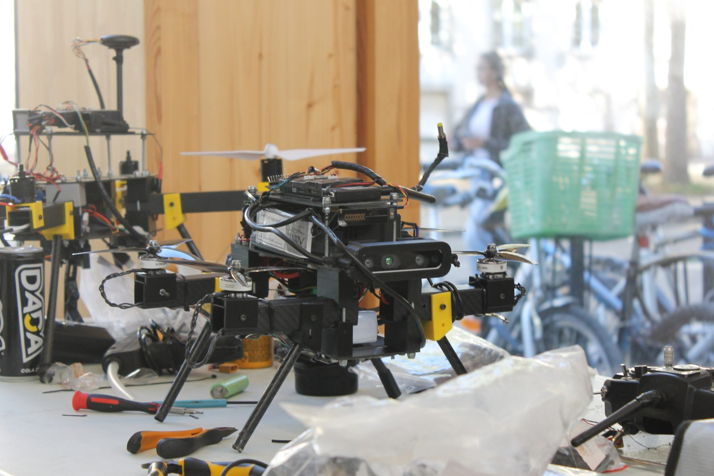
</p>

O pacote **indoor** é o software de voo autônomo para a competição IMAV 2026 Indoor. Ele conduz a aeronave por quatro tarefas sequenciais — **Percurso de Obstáculos → Inspeção da Sala → Entrega de Alvo → Pouso de Precisão** — com o ROS 2 e o Nectar SDK fornecendo as interfaces de veículo/percepção, enquanto o **Yasmin** orquestra cada missão como uma máquina de estados hierárquica.

## Sumário

1. [Veículo e Stack de Software](#veículo-e-stack-de-software)
2. [Arquitetura de Software](#arquitetura-de-software)
3. [Sequência de Missão de Alto Nível](#sequência-de-missão-de-alto-nível)
4. [Missão: Percurso de Obstáculos](#missão-percurso-de-obstáculos)
5. [Missão: Inspeção da Sala](#missão-inspeção-da-sala)
6. [Missão: Entrega de Alvo](#missão-entrega-de-alvo)
7. [Missão: Pouso de Precisão](#missão-pouso-de-precisão)
8. [Ferramentas Compartilhadas de Visão e Debug](#ferramentas-compartilhadas-de-visão-e-debug)
9. [Configuração e Presets](#configuração-e-presets)
10. [Executando a Missão](#executando-a-missão)

---

## Veículo e Stack de Software

### Hardware

| Componente | Detalhe |
|---|---|
| Controladora de voo | Pixhawk 6C rodando ArduPilot |
| Computador de bordo | NVIDIA Jetson Orin Nano Super |
| Câmera frontal (norte) | Intel RealSense D435i, RGB + profundidade, 640×480, ≈69,4°×42,5° de FOV |
| Câmera traseira (sul) | Logitech C920, 1640×1232, ≈70,4°×43,3° de FOV |
| Câmera inferior | Arducam IMX662 / C920e, 640×640, ≈86°×47° de FOV |
| Navegação | Pose de visão (`PoseSource.VISION`). Na aeronave isso costuma ser o NVIDIA Isaac ROS Visual SLAM. Este pacote não inicia o Isaac. |
| Atuadores | Garra de payload acionada por servo, LED de status controlado via WLED |

Os tópicos das câmeras, índices de dispositivo, offsets e configurações de processamento ficam em [`indoor/config.py`](indoor/config.py). **Confira esses valores contra a calibração e o launch de câmeras realmente usados antes do voo** — o SITL usa tópicos e sensores diferentes (ver `Config.apply_args`). O SITL republica a pose do Gazebo em `/visual_slam/tracking/vo_pose_covariance`; o bring-up está em [simulation/README.md](simulation/README.md) (somente em inglês). `--sitl` não inicia o Gazebo.

### Software

| Camada | Ferramenta |
|---|---|
| Middleware | [ROS 2](https://docs.ros.org/) |
| Link de voo | [pymavlink](https://github.com/ardupilot/pymavlink) (ROS ↔ MAVLink/ArduPilot) |
| API de veículo e visão | [Nectar SDK v1.1.0](https://github.com/Black-Bee-Drones/nectar-sdk/releases/tag/v1.1.0) |
| Orquestração de missão | Máquinas de estado hierárquicas [Yasmin](https://github.com/uleroboticsgroup/yasmin) |
| Processamento de imagem / ArUco | [OpenCV](https://opencv.org/) |
| Detecção de objetos | [Ultralytics YOLO](https://docs.ultralytics.com/) (detectores de gate, barras, caixas e bebê/pessoa) |
| Localização | `PoseSource.VISION` em `/visual_slam/tracking/vo_pose_covariance`. O [Isaac ROS Visual SLAM](https://github.com/NVIDIA-ISAAC-ROS/isaac_ros_visual_slam) é a fonte usual no veículo real; este pacote não o inicia. |

---

## Arquitetura de Software

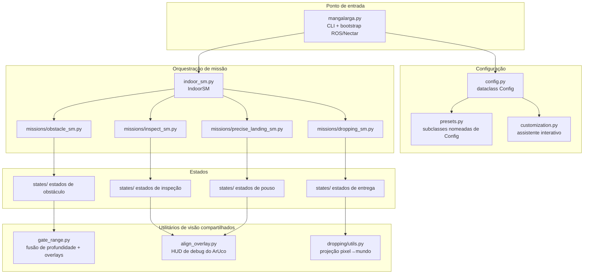

### Estrutura do repositório

```
indoor/indoor/                 # Pacote Python (a raiz do pacote ROS é indoor/)
├── mangalarga.py              # Executável ROS 2 / ponto de entrada da CLI
├── config.py                  # Dataclass Config (todos os parâmetros ajustáveis)
├── presets.py                 # Subclasses nomeadas de Config (CLEITINHO, FULL, ...)
├── customization.py           # Assistente interativo "--preset custom"
├── camera_index.py            # Busca de índice de dispositivo v4l2 pelo nome da câmera
├── indoor_sm.py               # Máquina de estados de alto nível (Initialize → Land)
├── gate_range.py              # Fusão de profundidade + desenho de overlay do gate (compartilhado)
├── gate_depth_check.py        # Ferramenta standalone de ajuste de gate/profundidade (fora da SM de missão)
├── missions/
│   ├── obstacle_sm.py
│   ├── inspect_sm.py
│   ├── dropping_sm.py
│   └── precise_landing_sm.py
└── states/
    ├── core/                  # initialize.py, takeoff.py, land.py
    ├── obstacle/              # go_to_obstacles.py, window.py, reacquire_window.py,
    │                          # to_bar_corridor.py, find_center_descend_bars.py,
    │                          # pass_blue.py, tubes.py
    ├── inspect/               # go_to_window.py, count_babies.py, go_out.py, align_overlay.py
    ├── dropping/              # go_to_box.py, map_boxes.py, center_box.py, act_box.py, utils.py
    └── precise_landing/       # go_to_landing_base.py, center_fixed.py, center_moving.py, reacquire.py
```

---

## Sequência de Missão de Alto Nível

A `IndoorSM` ([`indoor_sm.py`](indoor/indoor_sm.py)) encapsula as quatro missões entre um par compartilhado de **Initialize → Takeoff** e **Land**.

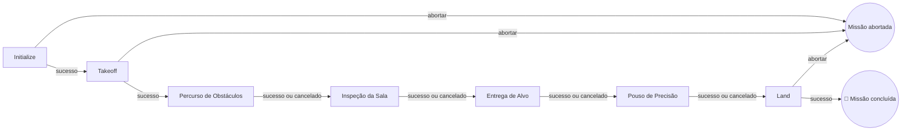

Um `CANCEL` de submissão segue para a etapa seguinte. Só `Initialize`, `Takeoff` e `Land` retornando `ABORT` encerram a execução. As flags de skip e os presets usam esse mesmo caminho para voos parciais.

<p align="center">
  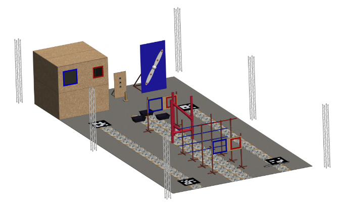
</p>

---

## Missão: Percurso de Obstáculos

**Estados envolvidos:** `GoToObstacles`, `Window`, `ReacquireWindow`, `ToBarCorridor`, `FindCenterDescendBars`, `PassBlue`, `Tubes`.

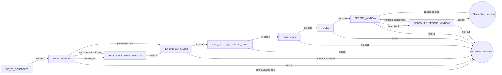

### Passo a passo

1. **`GoToObstacles`** marca o relógio da fase (`obstacle_start_time`) e voa três waypoints até o ponto de entrada do percurso, na altitude de gate. Pode ser cancelado diretamente (`obstacle_skip`) ou reduzido a um no-op se o veículo já tiver decolado em outro lugar (`skip_takeoff`).
2. **`Window` ("first"/"second")** é a travessia de gate servo-visual: um loop PID de duas fases que **alinha** com o gate detectado (erro em pixel lateral + vertical, com estimativa de distância fundindo bounding-box + câmera de profundidade), depois **avança devagar** mantendo a altitude até estar perto o suficiente para **comprometer-se** com um impulso final em malha aberta. Perder o gate dispara `reacquire`; a flag `skip` (config) sobrevoa sem sequer procurar o gate.
3. **`ReacquireWindow`** realiza varreduras laterais fixas procurando `_CONFIRM` (5) detecções consecutivas antes de devolver o controle ao `Window`.
4. **`ToBarCorridor`** sobe até uma altitude do degrau vermelho (1/2/3, selecionado por config) e se move para frente/lateralmente até o vão das barras.
5. **`FindCenterDescendBars`** procura marcadores de linha vermelha/azul com a câmera inferior, centraliza via PID no ponto médio do vão (estimando a posição da outra linha a partir do vão de barra conhecido, caso apenas uma linha esteja visível) e então desce até a altitude do degrau azul.
6. **`PassBlue`** — um curto impulso fixo para frente que atravessa a seção de barras já descida.
7. **`Tubes`** voa um padrão fixo de 3 pernas de desvio lateral para evitar o obstáculo de tubos (existe no código um auxiliar de aproximação por profundidade até um standoff, mas está atualmente comentado).

<p align="center">
  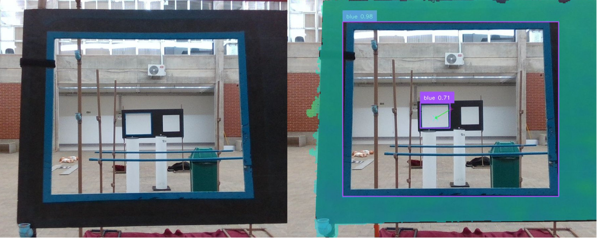
</p>

### Configurações principais (ver [`config.py`](indoor/config.py))

| Grupo | Chaves relevantes |
|---|---|
| Travessia de gate | `obstacle_gate_alt`, `obstacle_gate_standoff`, `obstacle_gate_width`, `obstacle_gate_kp/kd/ki`, `obstacle_gate_lost_tolerance`, `obstacle_gate_align_only` |
| Corredor de barras | `obstacle_red`, `obstacle_red_step_alt_*`, `obstacle_blue_1`, `obstacle_blue_step_alt_*`, `obstacle_bar_center_skip` |
| Tubos | `obstacle_tubes_skip`, `obstacle_tubes_x_avoid`, `obstacle_tubes_y_avoid`, `obstacle_tubes_alt` |
| Flags de skip | `obstacle_skip`, `obstacle_gate_first_skip`, `obstacle_gate_second_skip`, `obstacle_after_first_skip` |

---

## Missão: Inspeção da Sala

**Estados envolvidos:** `GoToWindow`, `Window("room")`, `ReacquireWindow("room")`, `CountBabies`, `GoOut`.

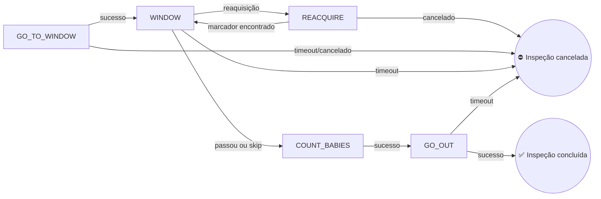

### Passo a passo

1. **`GoToWindow`** voa até o ponto de aproximação de inspeção, desce enquanto centraliza de forma grosseira em um **marcador ArUco** (não o detector YOLO de gate — um pipeline distinto de pixel/pose), guina 180° e então executa uma segunda passada PID mais fina, corrigindo X/Y/guinada, antes de finalizar.
2. **`Window("room")`** reutiliza exatamente o mesmo estado de travessia de gate do percurso de obstáculos, apenas apontado para a **câmera sul**, sem fusão com câmera de profundidade, e com parâmetros prefixados `inspect_gate_*`. Ao ter sucesso, registra `inspect_gate_alignment_alt` para o `GoOut` reutilizar depois.
3. **`CountBabies`** paira e amostra a câmera inferior `model_baby_sample_count` vezes (padrão 15), mesclando detecções sobrepostas de pessoa/urso de pelúcia (union-find por IOU) em uma única contagem por amostra, então escolhe a melhor amostra (opcionalmente restrita a uma contagem esperada conhecida) e salva uma imagem de debug rotulada.
4. **`GoOut`** voa para frente através da janela pela distância de standoff+comprometimento registrada e desliga a luz de status WLED.

<p align="center">
  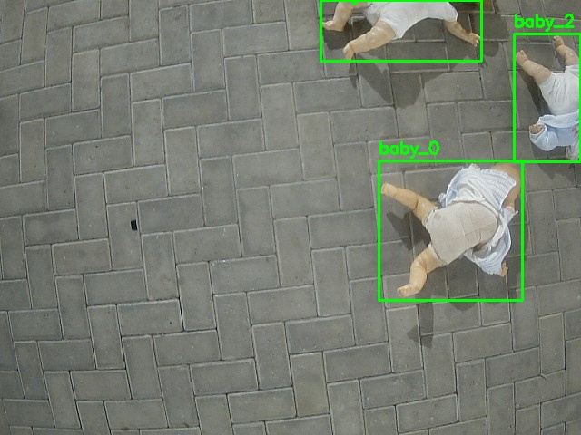
</p>

### Configurações principais

| Grupo | Chaves relevantes |
|---|---|
| Aproximação | `inspect_start_x/y/z`, `inspect_descent_speed`, `aruco_marker_dict`, `inspect_aruco_size` |
| Travessia da janela | `inspect_gate_standoff`, `inspect_gate_creep_vx`, `inspect_gate_commit_extra`, `obstacle_gate_room_skip` |
| Contagem | `model_baby_classes_names`, `model_baby_sample_count`, `model_baby_overlap_iou`, `inspect_babies_count` |
| Saída | `inspect_gate_alignment_alt` (definido em tempo de execução), auxiliar WLED estilo `dropping_led_gpio` |

---

## Missão: Entrega de Alvo

**Estados envolvidos:** `GoToBox`, `MapBoxes`, `CenterBox("drop"/"led")`, `ActBoxes("drop"/"led")`.

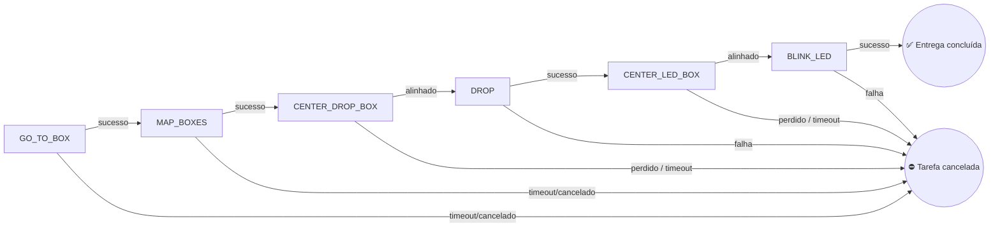

### Passo a passo

1. **`GoToBox`** voa um trajeto em malha aberta escalonado (Y depois X) até o ponto de aproximação da área de entrega.
2. **`MapBoxes`** dá uma única olhada com a câmera inferior, espera **exatamente três** caixas, ordena da esquerda para a direita, e geolocaliza as caixas alvo do LED e do cone/entrega em coordenadas absolutas no referencial de decolagem, usando projeção de câmera pinhole (`pixel_to_takeoff_frame`) combinada com a pose atual do veículo e a altitude do LIDAR.
3. **`CenterBox`** primeiro voa em malha aberta até a posição mapeada, depois executa uma passada PID fechada sobre redetecções ao vivo para centralizar finamente (com um "funil" de tolerância em pixel/tolerância métrica controlando quando pode descer) até confirmar o alinhamento por vários frames consecutivos.
4. **`ActBoxes`** comanda o servo de liberação do payload (`do_gripper`, com tentativas) ou pisca o LED de status em vermelho três vezes (`blink_led`), dependendo de qual alvo estava sendo centralizado.

### Configurações principais

| Grupo | Chaves relevantes |
|---|---|
| Aproximação | `dropping_start_x`, `dropping_start_y` |
| Mapeamento | `initialize.py` carrega `model_box_source` (`package.pt`) e `model_box_conf`. `center_box.py` filtra detecções com `model_dropping_box_name`. `model_dropping_box_source` (`box.pt`) e `model_dropping_box_conf` não são lidos. Geometria da câmera: `camera_down_hfov/vfov`, `camera_down_frame`. |
| Centralização | `dropping_box_kp/kd/ki`, `dropping_centralize_tolerance`, `dropping_center_drop_tolerance`, `dropping_center_drop_altitude`, `dropping_required_frames` |
| Atuação | `dropping_servo_channel`, `dropping_servo_open_pwm`, `dropping_servo_retries` |
| Skip | `droping_skip` (a grafia é a do campo de configuração e de `--droping-skip`) |

---

## Missão: Pouso de Precisão

**Estados envolvidos:** `GoToLandingBase`, `CenterFixed` **ou** `CenterMoving` (escolhido na construção), `Reacquire`.

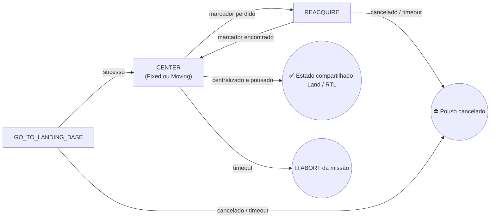

### Passo a passo

1. **`GoToLandingBase`** voa até as coordenadas alvo `precise_fixed` ou `precise_mobile`, em altitude segura, conforme `config.precise_fixed`.
2. **`CenterFixed`** (plataforma estacionária): um loop fechado a ~30 Hz lendo `(image, marker_id, translation, yaw)` da câmera inferior, corrigindo X/Y e guinada via PID (arredondada para o giro de 90° mais próximo), mantendo altitude até estar centralizado em XY e então descendo até `land_altitude` antes de declarar sucesso. Publica telemetria ao vivo em `blackboard['align_debug']` para o overlay de HUD compartilhado.
3. **`CenterMoving`** (plataforma móvel, **experimental**): primeiro alinha a guinada, depois amostra o marcador oscilante para estimar sua velocidade e pontos de inversão (ajuste linear ao longo de vários meio-ciclos), paira sobre o centro estimado de sua trajetória e, por fim, sincroniza a descida final com o momento em que o marcador real cruza novamente aquele ponto.
4. **`Reacquire`** sobe verticalmente até o marcador reaparecer no campo de visão mais amplo, ou desiste ao atingir `max_alt`.

### Configurações principais

| Grupo | Chaves relevantes |
|---|---|
| Aproximação | `precise_fixed`, `precise_fixed_x/y`, `precise_mobile_x/y` |
| Centralização | `precise_xy_kp/ki`, `obstacle_alt_kp`, `center_threshold_xy`, `land_altitude`, `precise_descend_vz` |
| Reaquisição | `precise_reacquire_vz`, `max_alt`, `lost_tolerance` |

---

## Ferramentas Compartilhadas de Visão e Debug

Estes módulos não são estados em si, mas são usados em várias missões:

- **[`gate_range.py`](indoor/gate_range.py)** — fusão de alcance por profundidade/bounding-box (`fuse_z`, `z_from_bbox`, `z_from_frame`, `smooth_z`) e o desenho do overlay de debug da travessia de gate (`overlay_gate`, `draw_align_markers`, `draw_hud`), usados tanto pelo `Window` (voo real) quanto pelo `gate_depth_check.py` (ferramenta standalone de bancada para ajustar detecção de gate e alcance por profundidade, executada independentemente das máquinas de estado de missão).
- **[`states/inspect/align_overlay.py`](indoor/states/inspect/align_overlay.py)** — HUD de debug específico para ArUco (mira no centro da câmera, marcador no centro do ArUco, vetor de erro, leitura do PID), consumido por `CenterFixed`/`Reacquire` através da convenção compartilhada `blackboard['align_debug']`.

<p align="center">
  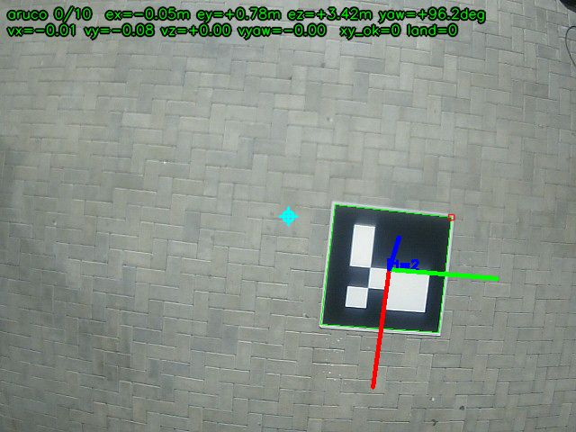
</p>

---

## Configuração e Presets

`Config` ([`config.py`](indoor/config.py)) é uma única dataclass contendo todos os parâmetros ajustáveis: conexão com o veículo, geometria das câmeras, pesos dos detectores, timeouts por missão, ganhos de PID, coordenadas de missão e flags de skip. Um **preset** ([`presets.py`](indoor/presets.py)) é uma subclasse de `Config` que sobrescreve um subconjunto desses campos para um teste específico ou um perfil de missão completa.

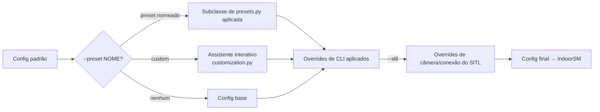

Presets atuais: `CLEITINHO`, `JORGE`, `TESTGATE`, `TESTGATEPASS`, `TESTGATEALIGN`, `TESTUAU`, `TESTBABIES`, `COMPLETE_MISSION1`, `TESTUAUUAU`, `PRECISIONLAND`, `VVV`, `SAMUEL`, `M1P`, `M2P`, `M1PSKIPBAR`, `M1PSKIPGATE`, `FULL`. Rode `--help` para confirmar as opções disponíveis no workspace instalado.

`--preset custom` inicia um assistente interativo de terminal (menus por setas) que reaproveita um preset existente ou monta uma configuração nova por etapas (opções do percurso de obstáculos → opções de inspeção → modo de pouso), podendo opcionalmente **anexar o resultado como um novo preset nomeado** diretamente em `presets.py` para reutilização futura.

### Resumo dos presets

| Preset | Obstáculos | Inspeção | Entrega | Pouso de Precisão | Observações |
|---|:---:|:---:|:---:|:---:|---|
| `CLEITINHO` | ✅ | ✅ | ⛔ | ⛔ | Apenas obstáculos + inspeção |
| `JORGE` | ⛔ | ⛔ | ✅ | ⛔ | Execução apenas de entrega |
| `TESTGATE` | janela pulada | ⛔ | ⛔ | ⛔ | Teste de bancada de detecção de gate, sem RTL |
| `TESTGATEPASS` | apenas 1º gate | ⛔ | ⛔ | ⛔ | Teste de travessia do primeiro gate |
| `TESTGATEALIGN` | apenas alinhamento | ⛔ | ⛔ | ⛔ | Ajuste de alinhamento, sem comprometimento |
| `TESTUAU` | ambos os gates | ⛔ | ⛔ | ⛔ | Teste completo de gate a gate |
| `TESTBABIES` | ⛔ | ✅ | ⛔ | ✅ | A inspeção roda (`inspect_skip` fica no padrão). Obstáculos e entrega ficam desligados. |
| `COMPLETE_MISSION1` / `TESTUAUUAU` | ✅ | ⛔ | ⛔ | ✅ fixo | Execuções completas de obstáculos + pouso |
| `PRECISIONLAND` | ⛔ | ⛔ | ⛔ | ✅ fixo | Apenas pouso |
| `VVV` / `SAMUEL` | ✅ (sem centralização de barras) | ✅ | ⛔ | ✅ fixo | Obstáculos (sem centralização de barra) + inspeção + pouso |
| `M1P` | ✅ | ⛔ | ⛔ | ✅ fixo | Percurso de obstáculos + pouso fixo |
| `M2P` | ⛔ | ✅ | ⛔ | ✅ fixo | Inspeção + pouso fixo |
| `M1PSKIPBAR` | ✅ (sem centralização de barras) | ⛔ | ⛔ | ✅ fixo | Obstáculos com a centralização da barra desligada |
| `M1PSKIPGATE` | gates pulados | ⛔ | ⛔ | ✅ fixo | Obstáculos com os dois gates e a centralização da barra desligados |
| `FULL` | ✅ | ✅ | ⛔ | ✅ fixo | Obstáculos, inspeção e pouso fixo. A entrega fica desligada (`droping_skip = True`). `JORGE` é o preset só de entrega. |

---

## Executando a Missão

O build está no [README do repositório](../README.pt-BR.md). Depois:

```bash
ros2 run indoor mangalarga --help
ros2 run indoor mangalarga --preset FULL
ros2 run indoor mangalarga --sitl --preset TESTGATE
ros2 run indoor mangalarga --preset custom
ros2 run indoor mangalarga --preset FULL --inspect-skip --droping-skip
ros2 run indoor mangalarga --preset PRECISIONLAND --no-takeoff
```

`--sitl` troca a conexão e os tópicos de câmera do nó. Não inicia o Gazebo nem o ArduPilot. Siga [simulation/README.md](simulation/README.md) antes e rode o nó da missão em outro terminal.

`ros2 launch indoor mangalarga.launch.py` e `simulation.launch.py` iniciam só o nó da missão. Eles passam `--config`, e o nó aceita `--preset`, então `config:=...` não seleciona um preset. Use `ros2 run` até esses wrappers coincidirem.

Flags suportadas: `--sitl`, `--preset`, `--obstacle-skip`, `--inspect-skip`, `--droping-skip`, `--precise-skip`, `--no-takeoff` (atalhos `-o-skip`, `-i-skip`, `-d-skip`, `-p-skip`). A grafia `droping` é a do campo de configuração. O assistente customizado precisa de um terminal interativo. Os presets ficam em `indoor/presets.py`; faça commit do resultado do assistente se ele precisar persistir.

Ferramenta de bancada para detecção de gate e profundidade:

```bash
ros2 run indoor gate_depth_check --sitl --show-result
```

---