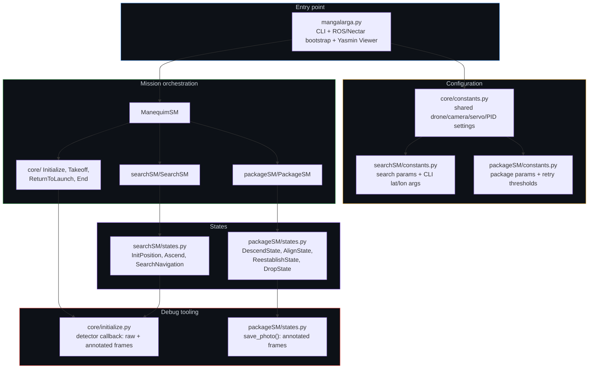
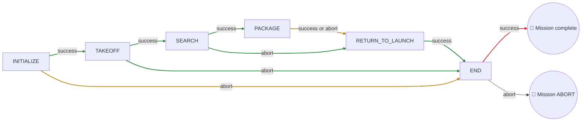
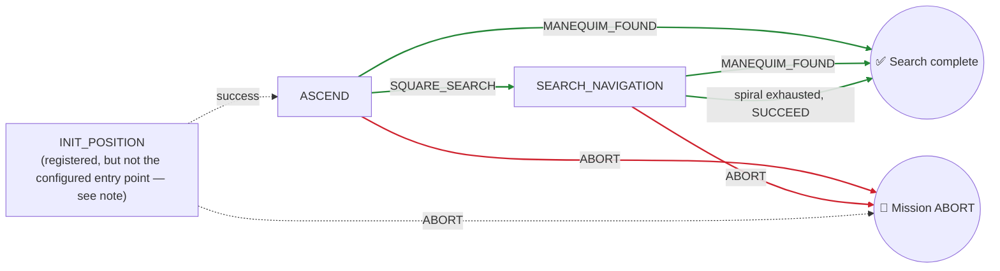
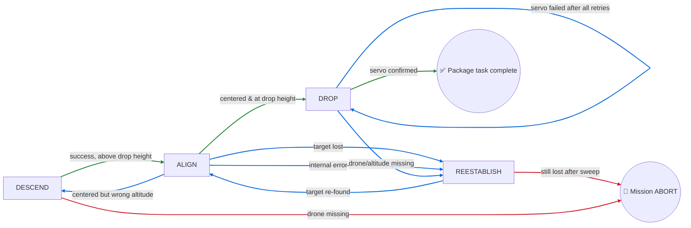

<p align="center">

| 🇧🇷 [Português](README.md) |🇺🇸 [English](README-EN.md) |
|:---:|:---:|

</p>

# IMAV 2026 Outdoor — Manequim

<p align="center">
  
</p>

The **manequim** mission package is the autonomous flight software for the IMAV 2026 Outdoor competition. It flies the aircraft through two sequential tasks — **Search (find the mannequin) → Package Delivery (drop on the target)** — before returning to launch and landing. ROS 2 and the Nectar SDK provide the vehicle/perception interfaces, GPS provides outdoor positioning, and **Yasmin** sequences the whole flight as a hierarchical state machine, published live to the **Yasmin Viewer** for real-time monitoring.

## Table of Contents

1. [Vehicle & Software Stack](#vehicle--software-stack)
2. [Software Architecture](#software-architecture)
3. [Top-Level Mission Sequence](#top-level-mission-sequence)
4. [Mission: Search](#mission-search)
5. [Mission: Package Delivery](#mission-package-delivery)
6. [Shared Vision & Debug Tooling](#shared-vision--debug-tooling)
7. [Configuration](#configuration)
8. [Running the Mission](#running-the-mission)

---

## Vehicle & Software Stack

### Hardware

| Component | Detail |
|---|---|
| Flight controller | ArduPilot-compatible FC, connected via MAVLink over serial (`/dev/ttyAMA1`) |
| Positioning | GPS (`PoseSource.GPS`) — the outdoor counterpart to the indoor package's Visual SLAM |
| Camera | Single downward-facing camera, selectable model: Logitech C920 (≈70.42°×43.3° FOV) or Arducam IMX662 (≈86°×47° FOV), both at 640×640 |
| Actuator | Servo-driven payload release mechanism (channel 2, open/closed PWM values) |

Camera model, servo channel/PWM values, drone connection string, and detector settings all live in [`manequim/core/constants.py`](manequim/core/constants.py). **Confirm `SIM_MODE`, `CONNECTION_STRING`, and `CAMERA_MODEL` match the deployed hardware before flight** — simulation and real-flight modes use different image sources and detector model paths.

### Software

| Layer | Tool |
|---|---|
| Middleware | [ROS 2](https://docs.ros.org/) |
| Flight link | MAVLink, via the Nectar SDK's `MavlinkDrone`/`MavrosDrone` |
| Vehicle & vision API | [Nectar SDK](https://github.com/Black-Bee-Drones/nectar-sdk) — drone control, camera handling, detection |
| Mission orchestration | [Yasmin](https://github.com/uleroboticsgroup/yasmin) hierarchical state machines, published live via `YasminViewerPub` under the `MANGALARGA_FSM` topic |
| Object detection | [Ultralytics YOLO](https://docs.ultralytics.com/) (`yolo26n.pt`), detecting `person` (and `kite` as a simulated-mannequin stand-in class in SITL) |

> **Note:** unlike the indoor package, `manequim` has no `check_timeout()`-style safety net anywhere in its states. Recovery loops (`AlignState`, `DropState`) rely entirely on internal attempt/retry counters — there is currently no global per-state or per-mission wall-clock timeout. Worth keeping in mind for field ops.

---

## Software Architecture



### Repository layout

```
manequim/
├── mangalarga.py            # ROS 2 executable / CLI entry point (builds ManequimSM)
├── core/
│   ├── constants.py         # Shared constants: sim mode, drone, camera, servo, PID
│   ├── initialize.py        # Initialize state (drone, PIDs, detector, camera)
│   ├── takeoff.py           # Takeoff state
│   ├── ReturnToLaunch.py    # ReturnToLaunch state
│   └── end.py               # End state (final landing)
├── searchSM/
│   ├── searchSM.py           # SearchSM
│   ├── states.py             # InitPosition, Ascend, SearchNavigation
│   └── constants.py          # Search altitudes/radius/thresholds + CLI --latitude/--longitude
└── packageSM/
    ├── packageSM.py           # PackageSM
    ├── states.py               # DescendState, AlignState, ReestablishState, DropState
    └── constants.py            # Package thresholds (lost/photo-fail/reestablish increment)
```

---

## Top-Level Mission Sequence

`ManequimSM` ([`mangalarga.py`](manequim/mangalarga.py)) wraps the two missions between a shared **Initialize → Takeoff** and **Return to Launch → End (land)** pair.



🟢 success/normal progress · 🟡 outcome routes to Return-to-Launch regardless of success or abort · 🔴 hard abort ends the run

**Key insight:** both `SEARCH` and `PACKAGE` route to `RETURN_TO_LAUNCH` on **either** outcome — success or abort. This mirrors the indoor package's philosophy of treating a sub-mission's failure as "move on" rather than aborting the whole flight: even if the mannequin is never found, or the package can never be dropped, the aircraft still flies home and lands cleanly. Only `INITIALIZE` and `TAKEOFF` failing skip straight to `END` without a return flight (the vehicle presumably never left a safe launch state).

<p align="center">
  
</p>

---

## Mission: Search

**States involved:** `InitPosition`, `Ascend`, `SearchNavigation`.



> **Note:** `SearchSM.set_start_state("ASCEND")` makes **`Ascend` the actual entry point** — `InitPosition` is registered in the state machine (with a working `SUCCEED`/`ABORT` transition table) but nothing currently transitions into it, so it never runs. Worth confirming whether it's a leftover from an earlier GPS-approach design or should be wired back in as the real starting state.

### Walkthrough

1. **`InitPosition`** *(currently unreachable — see note above)* is designed to fly to a configured GPS coordinate (`LATITUDE`/`LONGITUDE`, settable via `--latitude`/`--longitude` on the CLI) before the search begins. In `SIM_MODE`, or when no coordinates are configured, it's a no-op that returns `SUCCEED` immediately without erroring.
2. **`Ascend`** — the real mission entry point. Climbs to `ASCEND_HEIGHT`, takes up to 3 photos, and checks each for a confident `person`/`kite`-class detection. Every confirmed sighting increments a persistent `blackboard['manequim_detections']` counter; once it reaches `MANEQUIM_NUMBER` confirmations, `Ascend` reports `MANEQUIM_FOUND` immediately — the spiral search never even runs. Otherwise it proceeds to `SQUARE_SEARCH`.
3. **`SearchNavigation`** first descends to `SEARCH_ALTITUDE`, then builds an outward square spiral of waypoints (`_build_square_spiral`) sized against `SEARCH_RADIUS` and a step derived from the camera's horizontal FOV at that altitude (with a small overlap margin baked in so consecutive photos don't miss ground between them). It flies the spiral leg by leg — converting each map-frame waypoint into body-frame motion using the vehicle's running yaw, so the nose points down every new leg — repeating `Ascend`'s confirmation-counting logic at each stop. Reaching `MANEQUIM_NUMBER` confirmations at any waypoint halts the vehicle and returns `MANEQUIM_FOUND`; completing the whole spiral without confirmation returns plain `SUCCEED`.

> **Note:** `SearchSM` maps both `SUCCEED` (spiral exhausted, nothing confirmed) and `MANEQUIM_FOUND` (target confirmed) to the **same outcome** at the top level. `ManequimSM` therefore always proceeds into the Package mission next, with no built-in way to distinguish "target found" from "search radius used up." If the drop logic should behave differently in each case, that distinction needs to be threaded through explicitly (e.g. via the blackboard).

### Key config (`searchSM/constants.py`)

| Group | Notable keys |
|---|---|
| Altitudes | `ASCEND_HEIGHT`, `SEARCH_ALTITUDE` |
| Spiral shape | `SEARCH_RADIUS` |
| Confirmation | `MANEQUIM_NUMBER` (consecutive/repeated confirmations required before declaring a find) |
| Outcomes | `SQUARE_SEARCH`, `MANEQUIM_FOUND` (custom Yasmin outcome strings) |
| Initial GPS approach | `LATITUDE`, `LONGITUDE` (via `configure_coordinates()` / `--latitude`, `--longitude` CLI flags) |

---

## Mission: Package Delivery

**States involved:** `DescendState`, `AlignState`, `ReestablishState`, `DropState`.



🟢 success/normal progress · 🔵 recovery/retry loop · 🔴 hard failure ends the task

### Walkthrough

1. **`DescendState`** reads current altitude: if already at or below `DROP_HEIGHT`, it climbs back up to exactly `DROP_HEIGHT` and reports `SUCCEED`; otherwise it steps down by up to 0.5 m at a time (capped so it never overshoots past `DROP_HEIGHT` in one step) and also reports `SUCCEED`. `ALIGN` and `DESCEND` alternate this way, gradually converging on the drop altitude while re-checking alignment each time.
   > Its `__init__` declares an `ALIGNMENT_FAILED` outcome and the state machine wires a transition for it (`ALIGNMENT_FAILED → ABORT`), but the current `execute()` only ever returns `SUCCEED`/`ABORT` — that transition is currently dead code.
2. **`AlignState`** loops continuously: samples the camera, filters detections to `DETECTOR_CLASS`, and PID-corrects (`pid_cx`/`pid_cy`) toward the highest-confidence detection's pixel center, converting pixel error to a metric offset via `ppm()` (pixels-per-meter, using current altitude and camera FOV). Once both PID outputs settle to exactly zero (within their deadband), it checks whether altitude is already within 0.2 m of `DROP_HEIGHT`: if so, returns `SUCCEED` (ready to drop); if not, returns `"DESCEND"` to have `DescendState` take another altitude step first. Losing the target for `LOST_THRESHOLD` iterations (or the confidence dropping below 0.5) returns `LOST_PERSON`; repeated camera read failures beyond `PHOTO_FAIL_THRESHOLD` return `ALIGNMENT_FAILED` (a hard stop, unlike the recoverable `LOST_PERSON`).
   > Two details worth double-checking: the velocity command swaps axes (`vx=pid_cy`'s output, `vy=pid_cx`'s output) — verify that's the intended body/camera-frame mapping and not a naming slip — and the loop has no timeout, so a PID that never settles both axes to *exactly* zero simultaneously could in principle run indefinitely.
3. **`ReestablishState`** first climbs to `REESTABILISH_ALTITUDE_INCREMENT` if below it, then flies a small fixed 4-leg box pattern (right, back-left, forward, forward again) around the current position, sampling for the target after each leg. Finding it at any leg returns `SUCCEED` immediately (staying at that leg's position, ready to resume `AlignState`); a leg that finds nothing is undone (the drone backs up to its prior position) before trying the next. Exhausting all four legs without success returns `LOST_PERSON`, which the state machine maps straight to `ABORT` — the package mission gives up entirely and the flight proceeds to `RETURN_TO_LAUNCH`.
4. **`DropState`** stops in place, then attempts to open the payload servo up to `DROP_MAX_RETRIES` times with `RETRY_DELAY` between attempts. The first successful servo command returns `SUCCEED` (package mission complete). Exhausting all retries returns `DROP_RETRY`, which the state machine routes straight back into `DROP` itself for another full batch of `DROP_MAX_RETRIES` attempts — with no outer cap, this can in principle retry forever if the servo never responds (see the no-timeout note above).

> **Fallback drop:** notice that `ReturnToLaunch` (in `core/`) *also* attempts a servo-open command before flying home, independent of whatever `DropState` already did. This reads as a deliberate safety net — if the package mission gave up (`LOST_PERSON`) without ever successfully dropping, the aircraft still gets one more chance to release the payload on the way home.

### Key config (`core/constants.py` + `packageSM/constants.py`)

| Group | Notable keys |
|---|---|
| Altitude | `DROP_HEIGHT` |
| Alignment PID | `X_KP/KI/KD`, `Y_KP/KI/KD`, `XY_OUTPUT_LIM`, `XY_INTEGRAL_LIM`, `XY_OUTPUT_DEADBAND` |
| Camera geometry | `CAMERA_HFOV/VFOV`, `IMAGE_WIDTH/HEIGHT`, `CAMERA_MODEL` (`C920` or `IMX`) |
| Recovery thresholds | `LOST_THRESHOLD`, `PHOTO_FAIL_THRESHOLD`, `REESTABILISH_ALTITUDE_INCREMENT` |
| Actuation | `SERVO_CHANNEL`, `SERVO_OPEN_PWM`, `SERVO_CLOSED_PWM`, `DROP_MAX_RETRIES`, `RETRY_DELAY` |

---

## Shared Vision & Debug Tooling

Two independent image-saving mechanisms exist side by side — worth being aware both are running, since they save to different places on different triggers:

- **`Initialize.detector_mannequin_callback`** ([`core/initialize.py`](manequim/core/initialize.py)) fires automatically on **every frame** the camera's image-processing pipeline handles (not just search waypoints), saving both the raw and YOLO-annotated frame under a per-run, timestamped folder: `~/ros2_ws/imav-2026/manequim/mannequin-<run-start-timestamp>/images/{mannequin, mannequin_annotated}/`.
- **`save_photo()`** ([`packageSM/states.py`](manequim/packageSM/states.py), module-level helper) is instead called **explicitly** by `Ascend`/`SearchNavigation` after each detection attempt, saving only the annotated frame to a flat `images/` folder at the package root, named by state (`ascend-...`, `search-...`).

> These two conventions differ in both trigger (automatic callback vs. explicit call) and output layout (nested per-run folders vs. a flat directory) — consolidating them into one shared debug-image utility (as the indoor package does with `gate_range.py`) would make it easier to find and prune old debug captures.

---

## Configuration

Unlike the indoor package, `manequim` currently has **no preset system or interactive wizard** — configuration is split across three plain constants modules, edited directly or overridden via a couple of CLI flags:

| Module | Scope |
|---|---|
| [`core/constants.py`](manequim/core/constants.py) | Shared/global: `SIM_MODE`, drone connection (`CONNECTION_STRING`, `DRONE_TYPE`), camera model & geometry, YOLO detector source/confidence/classes, servo channel/PWM, alignment PID gains, `TAKEOFF_HEIGHT`, `RTL_ALTITUDE` |
| [`searchSM/constants.py`](manequim/searchSM/constants.py) | Search-only: `ASCEND_HEIGHT`, `SEARCH_ALTITUDE`, `SEARCH_RADIUS`, `MANEQUIM_NUMBER`, optional `LATITUDE`/`LONGITUDE`, plus `parse_args()`/`configure_coordinates()` for the CLI |
| [`packageSM/constants.py`](manequim/packageSM/constants.py) | Package-only: `LOST_THRESHOLD`, `PHOTO_FAIL_THRESHOLD`, `REESTABILISH_ALTITUDE_INCREMENT` |

> **Note:** `core/constants.py` currently defines `DRONE_TYPE = "mavlink" if not SIM_MODE else "mavlink"` — both branches of that ternary resolve to `"mavlink"`, so it's effectively hardcoded. Worth confirming whether `mavros` support (which `Initialize` does otherwise handle) is meant to be reachable through this constant.

The only supported CLI overrides today are the initial GPS coordinates:

```bash
ros2 run manequim mangalarga --latitude -22.9931 --longitude -46.5432
```

---

## Running the Mission

Build and source the ROS 2 workspace, then run the mission executable:

```bash
cd ~/ros2_ws
colcon build --packages-select manequim
source install/setup.bash
ros2 run manequim mangalarga
```

Run with an initial GPS approach point configured:

```bash
ros2 run manequim mangalarga --latitude -22.9931 --longitude -46.5432
```

The state machine's execution is published live to the **Yasmin Viewer** under the `MANGALARGA_FSM` topic — connect the viewer tool during a run to watch state transitions (`INITIALIZE → TAKEOFF → SEARCH → PACKAGE → RETURN_TO_LAUNCH → END`) in real time.

Toggle `SIM_MODE` in [`core/constants.py`](manequim/core/constants.py) to switch between the Gazebo-backed simulation image/detector paths and the real onboard camera/model paths before building.

---