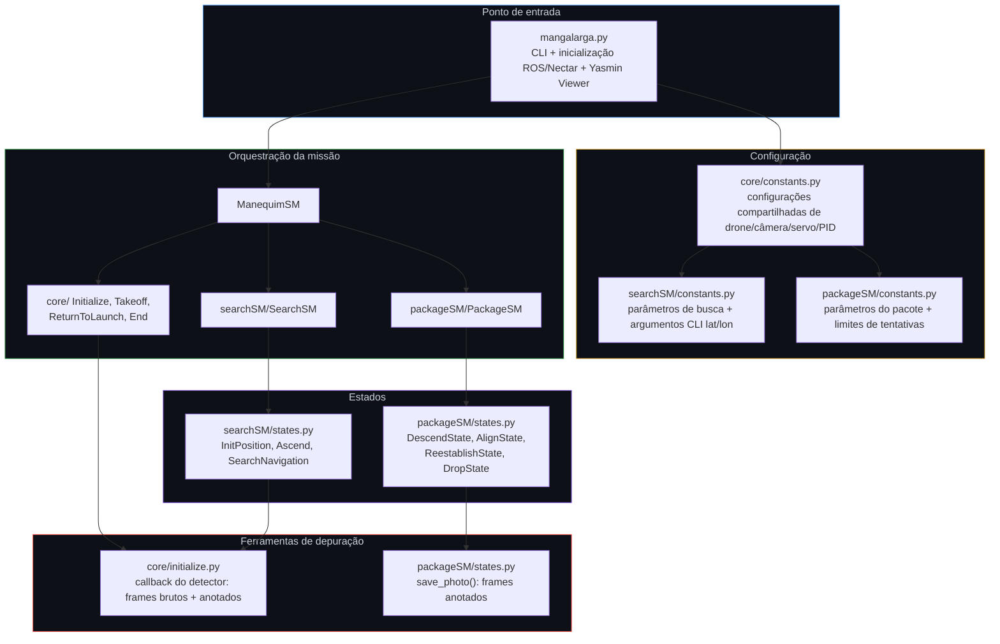
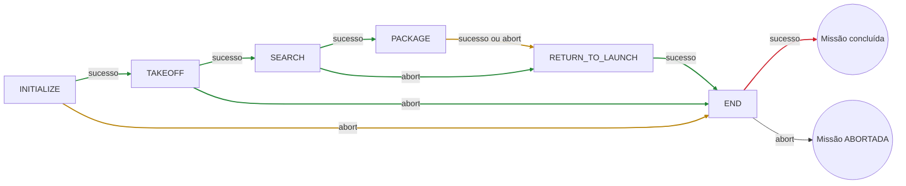
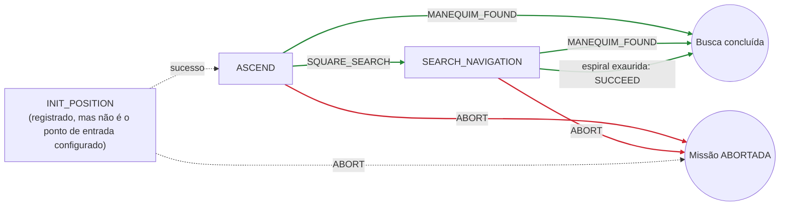
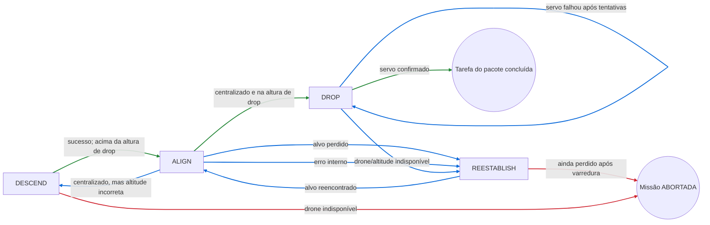

<p align="center">

| 🇧🇷 [Português](README.md) | 🇺🇸 [English](README-EN.md) |
|:---:|:---:|

</p>

# IMAV 2026 Outdoor — Manequim

<p align="center">
  
</p>

A aeronave da equipe Black Bee Drones participa da competição outdoor. O pacote de missão **manequim** é o software de voo autônomo para a competição IMAV 2026 Outdoor. Ele pilota a aeronave por duas tarefas sequenciais — **Busca (encontrar o manequim) → Entrega do Pacote (lançar no alvo)** — antes de retornar à base e pousar. O ROS 2 e o Nectar SDK fornecem as interfaces de veículo e percepção, o GPS fornece o posicionamento outdoor, e o **Yasmin** sequencia todo o voo como uma máquina de estados hierárquica, publicada ao vivo no **Yasmin Viewer** para monitoramento em tempo real.

## Índice

1. [Veículo e stack de software](#veículo-e-stack-de-software)
2. [Arquitetura de software](#arquitetura-de-software)
3. [Sequência de missão de nível superior](#sequência-de-missão-de-nível-superior)
4. [Missão: Busca](#missão-busca)
5. [Missão: Entrega do pacote](#missão-entrega-do-pacote)
6. [Ferramentas compartilhadas de visão e depuração](#ferramentas-compartilhadas-de-visão-e-depuração)
7. [Configuração](#configuração)
8. [Executando a missão](#executando-a-missão)

---

## Veículo e stack de software

### Hardware

| Componente | Detalhe |
|---|---|
| Controladora de voo | FC compatível com ArduPilot, conectada via MAVLink por serial (`/dev/ttyAMA1`) |
| Posicionamento | GPS (`PoseSource.GPS`), contraparte outdoor do Visual SLAM do pacote indoor |
| Câmera | Câmera única voltada para baixo; Logitech C920 (FOV ≈70,42° × 43,3°) ou Arducam IMX662 (FOV ≈86° × 47°), ambas em 640 × 640 |
| Atuador | Mecanismo de liberação de carga útil acionado por servo (canal 2, valores PWM de aberto/fechado) |

O modelo da câmera, os valores de canal/PWM do servo, a string de conexão do drone e as configurações do detector estão em [`manequim/core/constants.py`](manequim/core/constants.py). **Confirme se `SIM_MODE`, `CONNECTION_STRING` e `CAMERA_MODEL` correspondem ao hardware embarcado antes do voo**: os modos de simulação e voo real utilizam fontes de imagem e caminhos de modelo do detector diferentes.

### Software

| Camada | Ferramenta |
|---|---|
| Middleware | [ROS 2](https://docs.ros.org/) |
| Link de voo | MAVLink, via `MavlinkDrone`/`MavrosDrone` do Nectar SDK |
| API de veículo e visão | [Nectar SDK](https://github.com/Black-Bee-Drones/nectar-sdk), para controle do drone, câmera e detecção |
| Orquestração da missão | Máquinas de estados hierárquicas do [Yasmin](https://github.com/uleroboticsgroup/yasmin), publicadas ao vivo por `YasminViewerPub` no tópico `MANGALARGA_FSM` |
| Detecção de objetos | [Ultralytics YOLO](https://docs.ultralytics.com/) (`yolo26n.pt`), detectando `person` e `kite` como classe substituta de manequim simulado no SITL |

## Arquitetura de software



### Estrutura do repositório

```text
manequim/
├── mangalarga.py            # Executável ROS 2 / entrada CLI (monta ManequimSM)
├── core/
│   ├── constants.py         # Constantes compartilhadas: simulação, drone, câmera, servo, PID
│   ├── initialize.py        # Inicialização do drone, PIDs, detector e câmera
│   ├── takeoff.py           # Estado de decolagem
│   ├── ReturnToLaunch.py    # Estado de retorno à base
│   └── end.py               # Estado final (pouso)
├── searchSM/
│   ├── searchSM.py          # Máquina de estados SearchSM
│   ├── states.py             # InitPosition, Ascend, SearchNavigation
│   └── constants.py          # Altitudes/raio/limites + CLI --latitude/--longitude
└── packageSM/
    ├── packageSM.py          # Máquina de estados PackageSM
    ├── states.py              # DescendState, AlignState, ReestablishState, DropState
    └── constants.py           # Limites do pacote e incremento de restabelecimento
```

---

## Sequência de missão de nível superior

A `ManequimSM` ([`mangalarga.py`](manequim/mangalarga.py)) envolve as duas missões entre os estados compartilhados **Initialize → Takeoff** e **Return to Launch → End (pousar)**.



🟢 Sucesso/progresso normal · 🟡 o resultado direciona para Return-to-Launch · 🔴 abort crítico encerra a execução

**Ponto-chave:** tanto `SEARCH` quanto `PACKAGE` direcionam para `RETURN_TO_LAUNCH` em qualquer resultado — sucesso ou abort. Assim, mesmo que o manequim não seja encontrado ou o pacote não possa ser lançado, a aeronave ainda retorna e pousa. Apenas falhas em `INITIALIZE` ou `TAKEOFF` pulam diretamente para `END`, sem um voo de retorno, pois o veículo presumivelmente ainda não saiu de uma condição segura de lançamento.

<p align="center">
  
</p>

---

## Missão: Busca

**Estados envolvidos:** `InitPosition`, `Ascend`, `SearchNavigation`.



### Passo a passo

1. **`InitPosition`** *(atualmente inacessível; veja a nota acima)* foi projetado para voar até uma coordenada GPS configurada (`LATITUDE`/`LONGITUDE`, definível via `--latitude`/`--longitude`). Em `SIM_MODE`, ou sem coordenadas configuradas, não faz nada e retorna `SUCCEED`.
2. **`Ascend`** é o ponto de entrada real da missão. Sobe até `ASCEND_HEIGHT`, tira até três fotos e verifica detecções confiáveis da classe `person`/`kite`. Cada avistamento confirmado incrementa o contador persistente `blackboard['manequim_detections']`. Ao atingir `MANEQUIM_NUMBER` confirmações, retorna `MANEQUIM_FOUND` sem iniciar a busca em espiral; caso contrário, segue para `SQUARE_SEARCH`.
3. **`SearchNavigation`** desce até `SEARCH_ALTITUDE` e constrói uma espiral quadrada para fora (`_build_square_spiral`), dimensionada por `SEARCH_RADIUS`. O passo deriva do FOV horizontal da câmera nessa altitude e inclui uma pequena sobreposição para evitar lacunas entre fotos consecutivas. A aeronave percorre cada perna, convertendo waypoints do referencial do mapa para movimentos no referencial do corpo usando o yaw atual. Em cada parada, repete a lógica de confirmação do `Ascend`. Atingir `MANEQUIM_NUMBER` interrompe a busca e retorna `MANEQUIM_FOUND`; completar a espiral sem confirmação retorna `SUCCEED`.

### Configurações principais (`searchSM/constants.py`)

| Grupo | Chaves relevantes |
|---|---|
| Altitudes | `ASCEND_HEIGHT`, `SEARCH_ALTITUDE` |
| Formato da espiral | `SEARCH_RADIUS` |
| Confirmação | `MANEQUIM_NUMBER` (confirmações repetidas necessárias para declarar um achado) |
| Resultados | `SQUARE_SEARCH`, `MANEQUIM_FOUND` (resultados personalizados do Yasmin) |
| Aproximação GPS inicial | `LATITUDE`, `LONGITUDE` (via `configure_coordinates()` e flags `--latitude`/`--longitude`) |

---

## Missão: Entrega do pacote

**Estados envolvidos:** `DescendState`, `AlignState`, `ReestablishState`, `DropState`.



🟢 Sucesso/progresso normal · 🔵 recuperação/nova tentativa · 🔴 falha crítica encerra a tarefa

### Passo a passo

1. **`DescendState`** consulta a altitude atual. Se já estiver na ou abaixo de `DROP_HEIGHT`, sobe até essa altura; caso contrário, desce em etapas de até 0,5 m sem ultrapassá-la. Em ambos os casos retorna `SUCCEED`. `ALIGN` e `DESCEND` alternam para convergir gradualmente à altitude de lançamento enquanto verificam o alinhamento. A máquina declara uma saída `ALIGNMENT_FAILED` e uma transição para `ABORT`, mas o `execute()` atual só retorna `SUCCEED`/`ABORT`; essa transição está inativa.
2. **`AlignState`** captura imagens, filtra detecções pela classe `DETECTOR_CLASS` e usa PID (`pid_cx`/`pid_cy`) para corrigir a posição em direção ao centro da detecção de maior confiança. Converte o erro em pixels para deslocamento métrico por `ppm()`, usando altitude e FOV da câmera. Quando as saídas PID ficam em zero dentro da zona morta, verifica se a altitude está a até 0,2 m de `DROP_HEIGHT`: se estiver, retorna `SUCCEED`; caso contrário, retorna `DESCEND`. Perder o alvo por `LOST_THRESHOLD` iterações (ou confiança abaixo de 0,5) retorna `LOST_PERSON`; falhas de leitura da câmera acima de `PHOTO_FAIL_THRESHOLD` retornam `ALIGNMENT_FAILED`.
3. **`ReestablishState`** sobe até `REESTABILISH_ALTITUDE_INCREMENT`, se necessário, e percorre um padrão fixo de quatro pernas ao redor da posição atual (direita, traseira-esquerda, frente, frente novamente), procurando o alvo após cada perna. Ao encontrá-lo, retorna `SUCCEED` e retoma `AlignState`. Se não encontrar, desfaz a perna antes de tentar a próxima. Exaurir as quatro pernas retorna `LOST_PERSON`, mapeado para `ABORT`; o voo então segue para `RETURN_TO_LAUNCH`.
4. **`DropState`** para a aeronave e tenta abrir o servo até `DROP_MAX_RETRIES` vezes, aguardando `RETRY_DELAY` entre tentativas. Um comando bem-sucedido retorna `SUCCEED`. Esgotar as tentativas retorna `DROP_RETRY`, que a máquina direciona de volta a `DROP` para outro lote completo. Sem limite externo, as tentativas podem continuar indefinidamente se o servo não responder.

> **Liberação de fallback:** `ReturnToLaunch` também tenta abrir o servo antes de voar de volta, independentemente do resultado de `DropState`. Isso funciona como uma tentativa adicional de liberar a carga caso a missão do pacote tenha desistido sem sucesso.

### Configurações principais (`core/constants.py` e `packageSM/constants.py`)

| Grupo | Chaves relevantes |
|---|---|
| Altitude | `DROP_HEIGHT` |
| PID de alinhamento | `X_KP/KI/KD`, `Y_KP/KI/KD`, `XY_OUTPUT_LIM`, `XY_INTEGRAL_LIM`, `XY_OUTPUT_DEADBAND` |
| Geometria da câmera | `CAMERA_HFOV/VFOV`, `IMAGE_WIDTH/HEIGHT`, `CAMERA_MODEL` (`C920` ou `IMX`) |
| Limites de recuperação | `LOST_THRESHOLD`, `PHOTO_FAIL_THRESHOLD`, `REESTABILISH_ALTITUDE_INCREMENT` |
| Atuação | `SERVO_CHANNEL`, `SERVO_OPEN_PWM`, `SERVO_CLOSED_PWM`, `DROP_MAX_RETRIES`, `RETRY_DELAY` |

---

## Ferramentas compartilhadas de visão e depuração

Há dois mecanismos independentes de salvamento de imagens, com gatilhos e destinos diferentes:

- **`Initialize.detector_mannequin_callback`** ([`core/initialize.py`](manequim/core/initialize.py)) é acionado automaticamente em cada frame processado pelo pipeline da câmera. Salva o frame bruto e o frame anotado pelo YOLO em uma pasta por execução, com timestamp: `~/ros2_ws/imav-2026/manequim/mannequin-<timestamp>/images/{mannequin,mannequin_annotated}/`.
- **`save_photo()`** ([`packageSM/states.py`](manequim/packageSM/states.py)) é chamado explicitamente por `Ascend`/`SearchNavigation` após cada tentativa de detecção. Salva apenas o frame anotado em uma pasta `images/` plana na raiz do pacote, com nomes como `ascend-...` e `search-...`.

---

## Configuração

Diferentemente do pacote indoor, `manequim` não possui sistema de presets nem assistente interativo. A configuração é dividida em três módulos de constantes, editados diretamente ou parcialmente sobrescritos via CLI:

| Módulo | Escopo |
|---|---|
| [`core/constants.py`](manequim/core/constants.py) | Compartilhado/global: `SIM_MODE`, conexão do drone (`CONNECTION_STRING`, `DRONE_TYPE`), modelo/geometria da câmera, origem/confiança/classes do YOLO, canal/PWM do servo, ganhos PID, `TAKEOFF_HEIGHT`, `RTL_ALTITUDE` |
| [`searchSM/constants.py`](manequim/searchSM/constants.py) | Busca: `ASCEND_HEIGHT`, `SEARCH_ALTITUDE`, `SEARCH_RADIUS`, `MANEQUIM_NUMBER`, `LATITUDE`/`LONGITUDE`, `parse_args()` e `configure_coordinates()` |
| [`packageSM/constants.py`](manequim/packageSM/constants.py) | Pacote: `LOST_THRESHOLD`, `PHOTO_FAIL_THRESHOLD`, `REESTABILISH_ALTITUDE_INCREMENT` |

As únicas substituições de configuração suportadas pela CLI são as coordenadas GPS iniciais:

```bash
ros2 run manequim mangalarga --latitude -22.9931 --longitude -46.5432
```

---

## Executando a missão

Compile o pacote e carregue o ambiente do workspace ROS 2:

```bash
cd ~/ros2_ws
colcon build --packages-select manequim
source install/setup.bash
ros2 run manequim mangalarga
```

Para executar com um ponto inicial de aproximação GPS:

```bash
ros2 run manequim mangalarga --latitude -22.9931 --longitude -46.5432
```

A execução da máquina de estados é publicada ao vivo no **Yasmin Viewer**, pelo tópico `MANGALARGA_FSM`. Conecte o visualizador durante a execução para acompanhar as transições (`INITIALIZE → TAKEOFF → SEARCH → PACKAGE → RETURN_TO_LAUNCH → END`) em tempo real.

Altere `SIM_MODE` em [`core/constants.py`](manequim/core/constants.py) para alternar entre os caminhos de imagem/detecção do Gazebo e os caminhos da câmera/modelo embarcados antes de compilar.