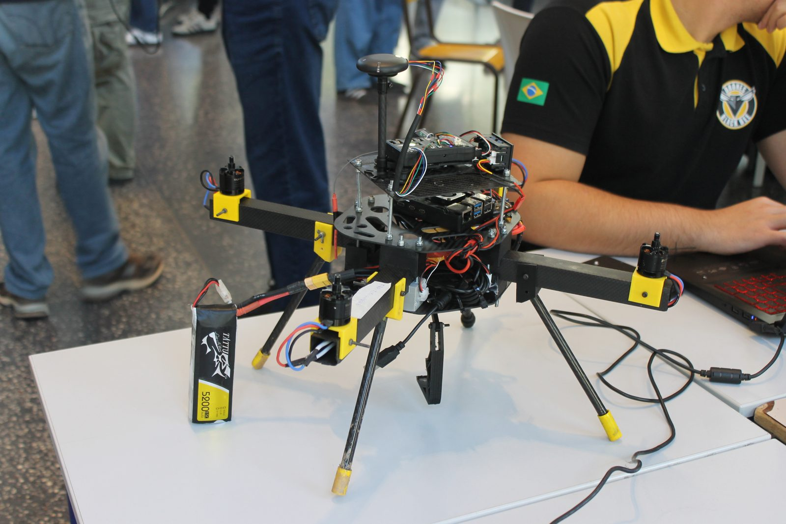
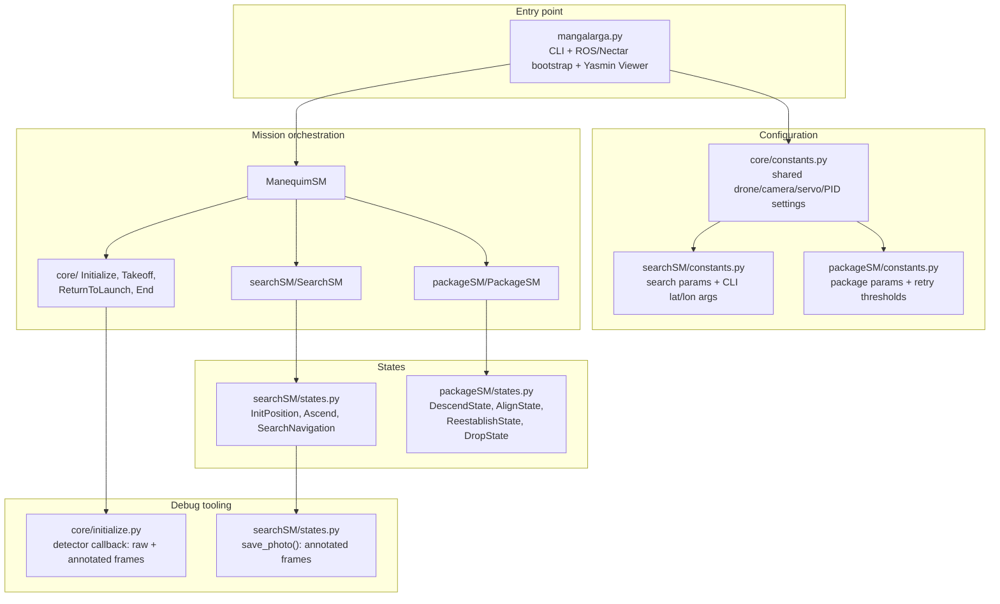
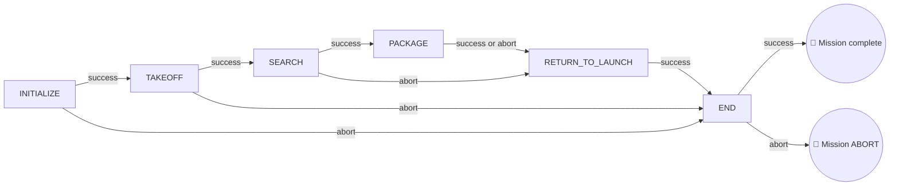
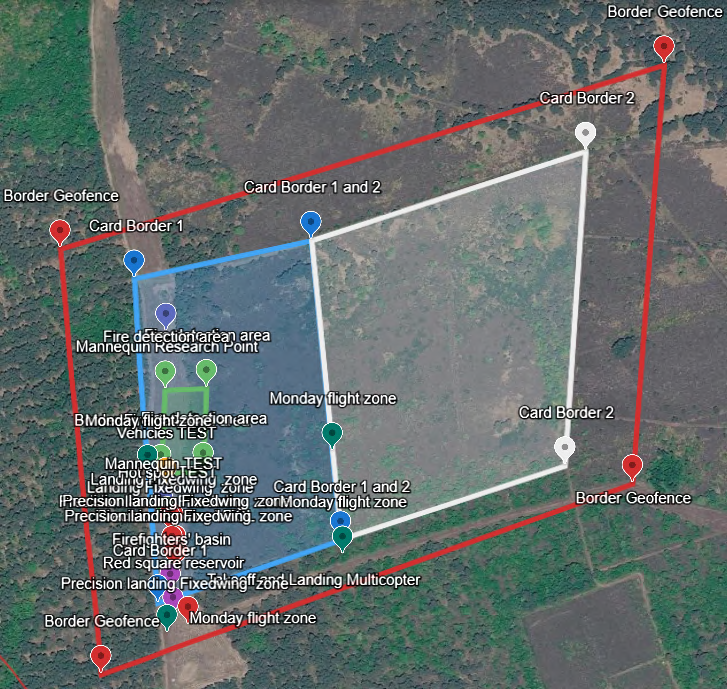
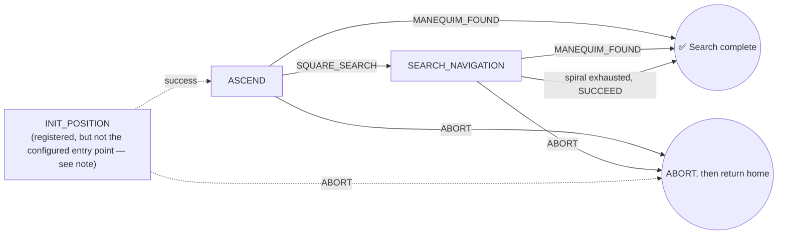
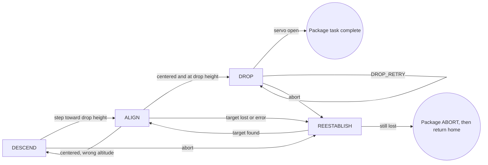

<p align="center">

| 🇧🇷 [Português](README.pt-BR.md) | 🇺🇸 [English](README.md) |
|:---:|:---:|

</p>

# IMAV 2026 Outdoor — Manequim

<p align="center">
  
</p>

The **manequim** mission package is the autonomous flight software for the IMAV 2026 Outdoor competition. It flies the aircraft through two sequential tasks — **Search (find the mannequin) → Package Delivery (drop on the target)** — before returning to launch and landing. ROS 2 and the Nectar SDK provide the vehicle/perception interfaces, GPS provides outdoor positioning, and **Yasmin** sequences the whole flight as a hierarchical state machine, published live to the **Yasmin Viewer** for real-time monitoring.

## Table of Contents

1. [Vehicle & Software Stack](#vehicle--software-stack)
2. [Software Architecture](#software-architecture)
3. [Top-Level Mission Sequence](#top-level-mission-sequence)
4. [Mission: Search](#mission-search)
5. [Mission: Package Delivery](#mission-package-delivery)
6. [Shared Vision & Debug Tooling](#shared-vision--debug-tooling)
7. [Configuration](#configuration)
8. [Running the Mission](#running-the-mission)

---

## Vehicle & Software Stack

### Hardware

| Component | Detail |
|---|---|
| Flight controller | ArduPilot-compatible FC. Real flight uses MAVLink on `CONNECTION_STRING` (`/dev/ttyAMA1`). With `SIM_MODE = True`, initialize uses Nectar `MAVLINK_SITL_CONFIG` and ignores that string. |
| Positioning | GPS (`PoseSource.GPS`) — the outdoor counterpart to the indoor package's Visual SLAM |
| Camera | Single downward-facing camera, selectable model: Logitech C920 (≈70.42°×43.3° FOV) or Arducam IMX662 (≈86°×47° FOV), both at 640×640 |
| Actuator | Servo-driven payload release mechanism (channel 2, open/closed PWM values) |

Camera model, servo PWM, connection string, and detector settings live in [`manequim/core/constants.py`](manequim/core/constants.py). **Confirm `SIM_MODE` and `CAMERA_MODEL` before flight.** `SIM_MODE` is read at runtime. With `--symlink-install` it is not a build step. Simulation and real flight use different image sources and detector paths. `DROP_HEIGHT`, `SERVO_OPEN_PWM`, and `SERVO_CLOSED_PWM` in `packageSM/constants.py` are shadowed by the core module (see [Package Delivery](#mission-package-delivery)).

### Software

| Layer | Tool |
|---|---|
| Middleware | [ROS 2](https://docs.ros.org/) |
| Flight link | MAVLink, via the Nectar SDK's `MavlinkDrone`/`MavrosDrone` |
| Vehicle & vision API | [Nectar SDK](https://github.com/Black-Bee-Drones/nectar-sdk) — drone control, camera handling, detection |
| Mission orchestration | [Yasmin](https://github.com/uleroboticsgroup/yasmin) hierarchical state machines, published live via `YasminViewerPub` under the `MANGALARGA_FSM` topic |
| Object detection | [Ultralytics YOLO](https://docs.ultralytics.com/) (`yolo26n.pt`), detecting `person` (and `kite` as a simulated-mannequin stand-in class in SITL) |


## Software Architecture



### Repository layout

```
manequim/
├── mangalarga.py            # ROS 2 executable / CLI entry point (builds ManequimSM)
├── core/
│   ├── constants.py         # Shared constants: sim mode, drone, camera, servo, PID
│   ├── initialize.py        # Initialize state (drone, PIDs, detector, camera)
│   ├── takeoff.py           # Takeoff state
│   ├── ReturnToLaunch.py    # ReturnToLaunch state
│   └── end.py               # End state (final landing)
├── searchSM/
│   ├── searchSM.py           # SearchSM
│   ├── states.py             # InitPosition, Ascend, SearchNavigation
│   └── constants.py          # Search altitudes/radius, MANEQUIM_NUMBER, CLI lat/lon and --manequim-number
└── packageSM/
    ├── packageSM.py           # PackageSM
    ├── states.py               # DescendState, AlignState, ReestablishState, DropState
    └── constants.py            # Lost/photo-fail/reestablish thresholds. Drop height and servo PWM here are shadowed by core/constants.py.
```

---

## Top-Level Mission Sequence

`ManequimSM` ([`mangalarga.py`](manequim/mangalarga.py)) wraps the two missions between a shared **Initialize → Takeoff** and **Return to Launch → End (land)** pair.



Search abort, and either package outcome, go to `RETURN_TO_LAUNCH`. Only `INITIALIZE` and `TAKEOFF` abort skip the return and go to `END`.

<p align="center">
  
</p>

---

## Mission: Search

**States involved:** `InitPosition`, `Ascend`, `SearchNavigation`.



### Walkthrough

1. **`InitPosition`** is registered, but `SearchSM` starts at `ASCEND`, so this state does not run. It would fly to `LATITUDE`/`LONGITUDE` (`--latitude` and `--longitude` together). In `SIM_MODE` it returns `SUCCEED` without moving. With no coordinates it logs an error and still returns `SUCCEED`.
2. **`Ascend`** — the real mission entry point. Climbs to `ASCEND_HEIGHT`, takes up to 3 photos, and checks each for a confident `person`/`kite`-class detection. Every confirmed sighting increments a persistent `blackboard['manequim_detections']` counter; once it reaches `MANEQUIM_NUMBER` confirmations, `Ascend` reports `MANEQUIM_FOUND` immediately — the spiral search never even runs. Otherwise it proceeds to `SQUARE_SEARCH`.
3. **`SearchNavigation`** first descends to `SEARCH_ALTITUDE`, then builds an outward square spiral of waypoints (`_build_square_spiral`) sized against `SEARCH_RADIUS` and a step derived from the camera's horizontal FOV at that altitude (with a small overlap margin baked in so consecutive photos don't miss ground between them). It flies the spiral leg by leg — converting each map-frame waypoint into body-frame motion using the vehicle's running yaw, so the nose points down every new leg — repeating `Ascend`'s confirmation-counting logic at each stop. Reaching `MANEQUIM_NUMBER` confirmations at any waypoint halts the vehicle and returns `MANEQUIM_FOUND`; completing the whole spiral without confirmation returns plain `SUCCEED`.

### Key config (`searchSM/constants.py`)

| Group | Notable keys |
|---|---|
| Altitudes | `ASCEND_HEIGHT`, `SEARCH_ALTITUDE` |
| Spiral shape | `SEARCH_RADIUS` |
| Confirmation | `MANEQUIM_NUMBER` (1–3, default 1), set by `--manequim-number`. Each confirmed sighting increments `blackboard['manequim_detections']`. Search succeeds when the count reaches this value. |
| Outcomes | `SQUARE_SEARCH`, `MANEQUIM_FOUND` (custom Yasmin outcome strings) |
| Initial GPS approach | `LATITUDE`, `LONGITUDE` (`--latitude` and `--longitude` together) |

---

## Mission: Package Delivery

**States involved:** `DescendState`, `AlignState`, `ReestablishState`, `DropState`.



### Walkthrough

Live drop height and servo PWM come from [`core/constants.py`](manequim/core/constants.py) (`DROP_HEIGHT = 2.0`, `SERVO_OPEN_PWM = 1600`, `SERVO_CLOSED_PWM = 2200`). `packageSM/states.py` imports that module after `packageSM/constants.py`, so the copies there (`0.65`, `1400`, `1900`) are not used.

1. **`DescendState`** steps toward `DROP_HEIGHT` by at most 0.5 m, or climbs back if it is already below. Each step returns to align. An abort here goes to reestablish. `execute()` does not return `ALIGNMENT_FAILED`, so that transition is unused.
2. **`AlignState`** PID-centers on the highest-confidence detection. Within 0.2 m of `DROP_HEIGHT` it goes on to the drop; otherwise it descends again. A lost target goes to reestablish. Camera failures past `PHOTO_FAIL_THRESHOLD` return `ALIGNMENT_FAILED` and abort the package task.
3. **`ReestablishState`** climbs by `REESTABILISH_ALTITUDE_INCREMENT` if needed, then flies a 4-leg box and samples after each leg. Finding the target returns to align. Giving up aborts the package task, and the top-level machine returns home.
4. **`DropState`** commands the servo open, up to `DROP_MAX_RETRIES` times. `DROP_RETRY` enters `DROP` again, with no outer cap.

`ReturnToLaunch` also commands the servo open before flying home.

### Key config

| Group | Where to edit | Keys |
|---|---|---|
| Altitude, servo, PID, camera | [`core/constants.py`](manequim/core/constants.py) | `DROP_HEIGHT`, `SERVO_CHANNEL`, `SERVO_OPEN_PWM`, `SERVO_CLOSED_PWM`, `DROP_MAX_RETRIES`, `RETRY_DELAY`, `X_KP/KI/KD`, `Y_KP/KI/KD`, `XY_OUTPUT_LIM`, `XY_INTEGRAL_LIM`, `XY_OUTPUT_DEADBAND`, `CAMERA_HFOV/VFOV`, `IMAGE_WIDTH/HEIGHT`, `CAMERA_MODEL` |
| Recovery | [`packageSM/constants.py`](manequim/packageSM/constants.py) | `LOST_THRESHOLD`, `PHOTO_FAIL_THRESHOLD`, `REESTABILISH_ALTITUDE_INCREMENT` |

---

## Shared Vision & Debug Tooling

Two writers save frames to different paths:

- **`Initialize.detector_mannequin_callback`** ([`core/initialize.py`](manequim/core/initialize.py)) runs on frames from the camera pipeline and writes raw and annotated images under `~/ros2_ws/imav-2026/manequim/mannequin-<run-start>/images/{mannequin,mannequin_annotated}/`.
- **`save_photo()`** ([`searchSM/states.py`](manequim/searchSM/states.py)) is called by `Ascend` and `SearchNavigation`. It writes `manequim/images/<state>-<timestamp>-annotated.png` next to the Python package (`manequim/manequim/images/`).

---

## Configuration

There is no preset system. Edit the constants modules, or pass the CLI flags below.

| Module | Scope |
|---|---|
| [`core/constants.py`](manequim/core/constants.py) | `SIM_MODE`, `CONNECTION_STRING` (real flight only), camera, detector, servo PWM, drop height, alignment PID, `TAKEOFF_HEIGHT`, `RTL_ALTITUDE` |
| [`searchSM/constants.py`](manequim/searchSM/constants.py) | `ASCEND_HEIGHT`, `SEARCH_ALTITUDE`, `SEARCH_RADIUS`, `MANEQUIM_NUMBER`, optional `LATITUDE`/`LONGITUDE` |
| [`packageSM/constants.py`](manequim/packageSM/constants.py) | `LOST_THRESHOLD`, `PHOTO_FAIL_THRESHOLD`, `REESTABILISH_ALTITUDE_INCREMENT`. Drop height and servo PWM in this file are shadowed. |

```bash
ros2 run manequim mangalarga --manequim-number 1 --latitude -22.9931 --longitude -46.5432
```

`--manequim-number` is the confirmed-detection count described above, not a separate target index in the state machine. `--latitude` and `--longitude` must be passed together.

---

## Running the Mission

Build from the [repository README](../README.md), then:

```bash
ros2 run manequim mangalarga --help
ros2 run manequim mangalarga --manequim-number 1
ros2 run manequim mangalarga --latitude -22.9931 --longitude -46.5432
```

Set `SIM_MODE` in [`core/constants.py`](manequim/core/constants.py) before the run. `True` uses the SITL connection and simulation camera/detector paths and does not use `CONNECTION_STRING`. In simulation, set `MANEQUIM_DETECTOR_MODEL` or place weights at `~/ros2_ws/yolo26n.pt`.

The state machine is published as `MANGALARGA_FSM` for the Yasmin viewer (`INITIALIZE → TAKEOFF → SEARCH → PACKAGE → RETURN_TO_LAUNCH → END`).

### Simulation status

The package ships Gazebo worlds under `Simulation/world/` and a local firefighter model under `Simulation/models/`, but no ROS 2 launch file and no documented end-to-end SITL bring-up. `world_test.sdf` references the `outdoor_field_scenery` and `iris_with_gimbal` models, which must come from the Nectar/ArduPilot simulation environment. `Simulation/script/random_base_location.py` depends on a separate mapping package and local workspace paths, so it does not run on its own. `setup.py` does not install `Simulation/`.

Once SITL and the model paths are up, start the node with `ros2 run manequim mangalarga` as above.

> **Image placeholder:** Add a Gazebo view of the outdoor field with the target mannequins and delivery area. Replace this note with an image when available.

---