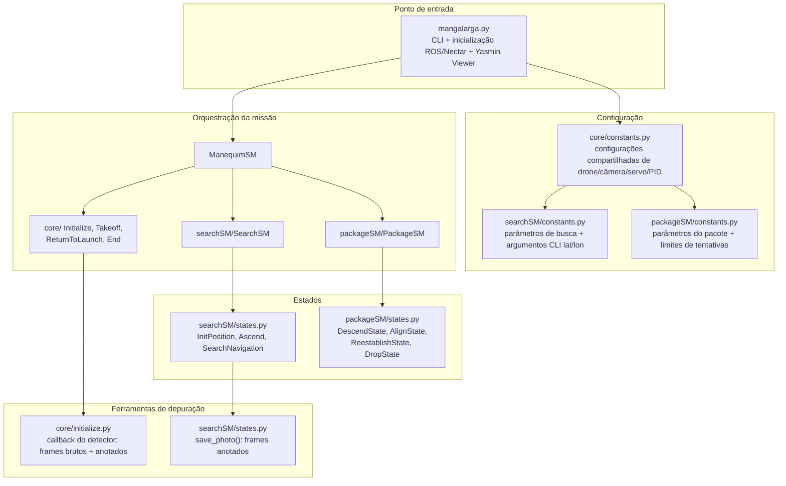
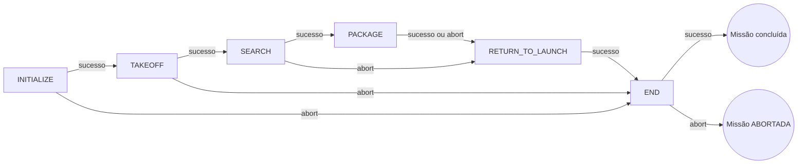
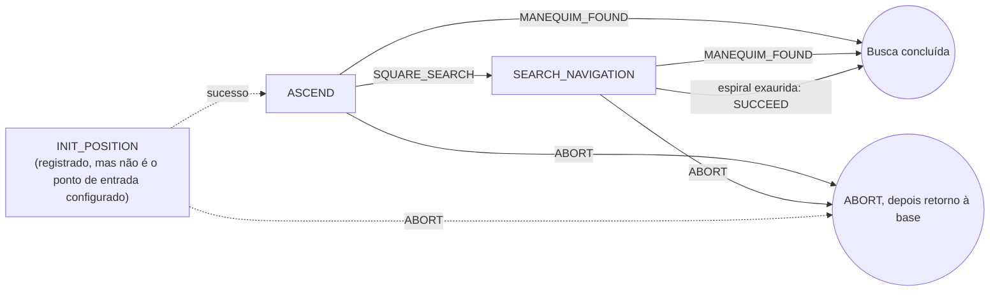
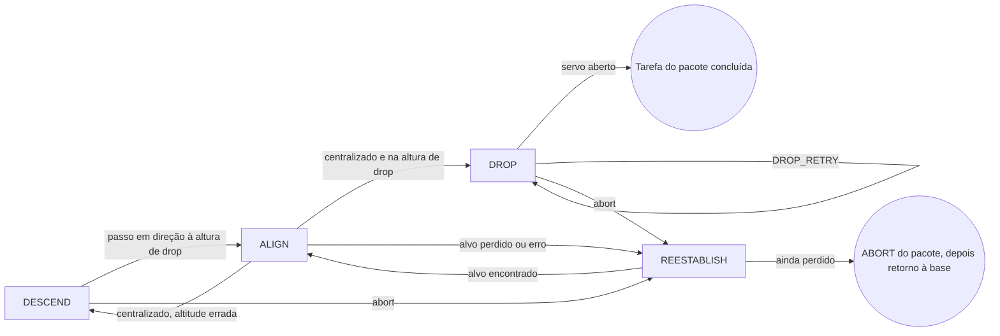

<p align="center">

| 🇧🇷 [Português](README.pt-BR.md) | 🇺🇸 [English](README.md) |
|:---:|:---:|

</p>

# IMAV 2026 Outdoor — Manequim

<p align="center">
  
</p>

A aeronave da equipe Black Bee Drones participa da competição outdoor. O pacote de missão **manequim** é o software de voo autônomo para a competição IMAV 2026 Outdoor. Ele pilota a aeronave por duas tarefas sequenciais — **Busca (encontrar o manequim) → Entrega do Pacote (lançar no alvo)** — antes de retornar à base e pousar. O ROS 2 e o Nectar SDK fornecem as interfaces de veículo e percepção, o GPS fornece o posicionamento outdoor, e o **Yasmin** sequencia todo o voo como uma máquina de estados hierárquica, publicada ao vivo no **Yasmin Viewer** para monitoramento em tempo real.

## Índice

1. [Veículo e stack de software](#veículo-e-stack-de-software)
2. [Arquitetura de software](#arquitetura-de-software)
3. [Sequência de missão de nível superior](#sequência-de-missão-de-nível-superior)
4. [Missão: Busca](#missão-busca)
5. [Missão: Entrega do pacote](#missão-entrega-do-pacote)
6. [Ferramentas compartilhadas de visão e depuração](#ferramentas-compartilhadas-de-visão-e-depuração)
7. [Configuração](#configuração)
8. [Executando a missão](#executando-a-missão)

---

## Veículo e stack de software

### Hardware

| Componente | Detalhe |
|---|---|
| Controladora de voo | FC compatível com ArduPilot. O voo real usa MAVLink em `CONNECTION_STRING` (`/dev/ttyAMA1`). Com `SIM_MODE = True`, a inicialização usa `MAVLINK_SITL_CONFIG` do Nectar e ignora essa string. |
| Posicionamento | GPS (`PoseSource.GPS`), contraparte outdoor do Visual SLAM do pacote indoor |
| Câmera | Câmera única voltada para baixo; Logitech C920 (FOV ≈70,42° × 43,3°) ou Arducam IMX662 (FOV ≈86° × 47°), ambas em 640 × 640 |
| Atuador | Mecanismo de liberação de carga útil acionado por servo (canal 2, valores PWM de aberto/fechado) |

O modelo da câmera, o PWM do servo, a string de conexão e o detector estão em [`manequim/core/constants.py`](manequim/core/constants.py). **Confirme `SIM_MODE` e `CAMERA_MODEL` antes do voo.** `SIM_MODE` é lido em tempo de execução. Com `--symlink-install` isso não é um passo de build. Simulação e voo real usam fontes de imagem e caminhos de detector diferentes. `DROP_HEIGHT`, `SERVO_OPEN_PWM` e `SERVO_CLOSED_PWM` em `packageSM/constants.py` são encobertos pelo módulo core (veja [Entrega do pacote](#missão-entrega-do-pacote)).

### Software

| Camada | Ferramenta |
|---|---|
| Middleware | [ROS 2](https://docs.ros.org/) |
| Link de voo | MAVLink, via `MavlinkDrone`/`MavrosDrone` do Nectar SDK |
| API de veículo e visão | [Nectar SDK](https://github.com/Black-Bee-Drones/nectar-sdk), para controle do drone, câmera e detecção |
| Orquestração da missão | Máquinas de estados hierárquicas do [Yasmin](https://github.com/uleroboticsgroup/yasmin), publicadas ao vivo por `YasminViewerPub` no tópico `MANGALARGA_FSM` |
| Detecção de objetos | [Ultralytics YOLO](https://docs.ultralytics.com/) (`yolo26n.pt`), detectando `person` e `kite` como classe substituta de manequim simulado no SITL |

## Arquitetura de software



### Estrutura do repositório

```text
manequim/
├── mangalarga.py            # Executável ROS 2 / entrada CLI (monta ManequimSM)
├── core/
│   ├── constants.py         # Constantes compartilhadas: simulação, drone, câmera, servo, PID
│   ├── initialize.py        # Inicialização do drone, PIDs, detector e câmera
│   ├── takeoff.py           # Estado de decolagem
│   ├── ReturnToLaunch.py    # Estado de retorno à base
│   └── end.py               # Estado final (pouso)
├── searchSM/
│   ├── searchSM.py          # Máquina de estados SearchSM
│   ├── states.py             # InitPosition, Ascend, SearchNavigation
│   └── constants.py          # Altitudes/raio, MANEQUIM_NUMBER, CLI lat/lon e --manequim-number
└── packageSM/
    ├── packageSM.py          # Máquina de estados PackageSM
    ├── states.py              # DescendState, AlignState, ReestablishState, DropState
    └── constants.py           # Limites de perda/foto/restabelecimento. Altura de drop e PWM do servo aqui são encobertos por core/constants.py.
```

---

## Sequência de missão de nível superior

A `ManequimSM` ([`mangalarga.py`](manequim/mangalarga.py)) envolve as duas missões entre os estados compartilhados **Initialize → Takeoff** e **Return to Launch → End (pousar)**.



Abort da busca, e qualquer resultado do pacote, vão para `RETURN_TO_LAUNCH`. Só abort de `INITIALIZE` e `TAKEOFF` pula o retorno e vai para `END`.

<p align="center">
  
</p>

---

## Missão: Busca

**Estados envolvidos:** `InitPosition`, `Ascend`, `SearchNavigation`.



### Passo a passo

1. **`InitPosition`** está registrado, mas a `SearchSM` começa em `ASCEND`, então esse estado não roda. Ele voaria até `LATITUDE`/`LONGITUDE` (`--latitude` e `--longitude` juntos). Em `SIM_MODE` retorna `SUCCEED` sem se mover. Sem coordenadas, registra um erro e ainda retorna `SUCCEED`.
2. **`Ascend`** é o ponto de entrada real da missão. Sobe até `ASCEND_HEIGHT`, tira até três fotos e verifica detecções confiáveis da classe `person`/`kite`. Cada avistamento confirmado incrementa o contador persistente `blackboard['manequim_detections']`. Ao atingir `MANEQUIM_NUMBER` confirmações, retorna `MANEQUIM_FOUND` sem iniciar a busca em espiral; caso contrário, segue para `SQUARE_SEARCH`.
3. **`SearchNavigation`** desce até `SEARCH_ALTITUDE` e constrói uma espiral quadrada para fora (`_build_square_spiral`), dimensionada por `SEARCH_RADIUS`. O passo deriva do FOV horizontal da câmera nessa altitude e inclui uma pequena sobreposição para evitar lacunas entre fotos consecutivas. A aeronave percorre cada perna, convertendo waypoints do referencial do mapa para movimentos no referencial do corpo usando o yaw atual. Em cada parada, repete a lógica de confirmação do `Ascend`. Atingir `MANEQUIM_NUMBER` interrompe a busca e retorna `MANEQUIM_FOUND`; completar a espiral sem confirmação retorna `SUCCEED`.

### Configurações principais (`searchSM/constants.py`)

| Grupo | Chaves relevantes |
|---|---|
| Altitudes | `ASCEND_HEIGHT`, `SEARCH_ALTITUDE` |
| Formato da espiral | `SEARCH_RADIUS` |
| Confirmação | `MANEQUIM_NUMBER` (1–3, padrão 1), definido por `--manequim-number`. Cada avistamento confirmado incrementa `blackboard['manequim_detections']`. A busca termina quando a contagem chega nesse valor. |
| Resultados | `SQUARE_SEARCH`, `MANEQUIM_FOUND` (resultados personalizados do Yasmin) |
| Aproximação GPS inicial | `LATITUDE`, `LONGITUDE` (`--latitude` e `--longitude` juntos) |

---

## Missão: Entrega do pacote

**Estados envolvidos:** `DescendState`, `AlignState`, `ReestablishState`, `DropState`.



### Passo a passo

A altura de drop e o PWM do servo usados vêm de [`core/constants.py`](manequim/core/constants.py) (`DROP_HEIGHT = 2.0`, `SERVO_OPEN_PWM = 1600`, `SERVO_CLOSED_PWM = 2200`). `packageSM/states.py` importa esse módulo depois de `packageSM/constants.py`, então as cópias de lá (`0.65`, `1400`, `1900`) não entram em vigor.

1. **`DescendState`** avança até `DROP_HEIGHT` em passos de no máximo 0,5 m, ou sobe de volta se já estiver abaixo. Cada passo volta ao alinhamento. Um abort aqui vai para o restabelecimento. `execute()` não retorna `ALIGNMENT_FAILED`, então essa transição não é usada.
2. **`AlignState`** centraliza por PID na detecção de maior confiança. A até 0,2 m de `DROP_HEIGHT` segue para o drop; senão desce de novo. Alvo perdido vai para o restabelecimento. Falhas de câmera além de `PHOTO_FAIL_THRESHOLD` retornam `ALIGNMENT_FAILED` e abortam a tarefa do pacote.
3. **`ReestablishState`** sobe `REESTABILISH_ALTITUDE_INCREMENT` se precisar, depois voa um retângulo de 4 pernas e amostra depois de cada perna. Achar o alvo volta ao alinhamento. Desistir aborta a tarefa do pacote, e a máquina de nível superior retorna à base.
4. **`DropState`** comanda o servo aberto, até `DROP_MAX_RETRIES` vezes. `DROP_RETRY` entra em `DROP` de novo, sem limite externo.

`ReturnToLaunch` também comanda o servo aberto antes de voltar à base.

### Configurações principais

| Grupo | Onde editar | Chaves |
|---|---|---|
| Altitude, servo, PID, câmera | [`core/constants.py`](manequim/core/constants.py) | `DROP_HEIGHT`, `SERVO_CHANNEL`, `SERVO_OPEN_PWM`, `SERVO_CLOSED_PWM`, `DROP_MAX_RETRIES`, `RETRY_DELAY`, `X_KP/KI/KD`, `Y_KP/KI/KD`, `XY_OUTPUT_LIM`, `XY_INTEGRAL_LIM`, `XY_OUTPUT_DEADBAND`, `CAMERA_HFOV/VFOV`, `IMAGE_WIDTH/HEIGHT`, `CAMERA_MODEL` |
| Recuperação | [`packageSM/constants.py`](manequim/packageSM/constants.py) | `LOST_THRESHOLD`, `PHOTO_FAIL_THRESHOLD`, `REESTABILISH_ALTITUDE_INCREMENT` |

---

## Ferramentas compartilhadas de visão e depuração

Dois trechos gravam frames em caminhos diferentes:

- **`Initialize.detector_mannequin_callback`** ([`core/initialize.py`](manequim/core/initialize.py)) roda nos frames do pipeline da câmera e grava imagens brutas e anotadas em `~/ros2_ws/imav-2026/manequim/mannequin-<início>/images/{mannequin,mannequin_annotated}/`.
- **`save_photo()`** ([`searchSM/states.py`](manequim/searchSM/states.py)) é chamado por `Ascend` e `SearchNavigation`. Grava `manequim/images/<estado>-<timestamp>-annotated.png` ao lado do pacote Python (`manequim/manequim/images/`).

---

## Configuração

Não há sistema de presets. Edite os módulos de constantes, ou passe as flags abaixo.

| Módulo | Escopo |
|---|---|
| [`core/constants.py`](manequim/core/constants.py) | `SIM_MODE`, `CONNECTION_STRING` (só voo real), câmera, detector, PWM do servo, altura de drop, PID de alinhamento, `TAKEOFF_HEIGHT`, `RTL_ALTITUDE` |
| [`searchSM/constants.py`](manequim/searchSM/constants.py) | `ASCEND_HEIGHT`, `SEARCH_ALTITUDE`, `SEARCH_RADIUS`, `MANEQUIM_NUMBER`, `LATITUDE`/`LONGITUDE` opcionais |
| [`packageSM/constants.py`](manequim/packageSM/constants.py) | `LOST_THRESHOLD`, `PHOTO_FAIL_THRESHOLD`, `REESTABILISH_ALTITUDE_INCREMENT`. Altura de drop e PWM do servo neste arquivo são encobertos. |

```bash
ros2 run manequim mangalarga --manequim-number 1 --latitude -22.9931 --longitude -46.5432
```

`--manequim-number` é a contagem de detecções confirmadas descrita acima, não um índice de alvo separado na máquina de estados. `--latitude` e `--longitude` precisam ser passados juntos.

---

## Executando a missão

O build está no [README do repositório](../README.pt-BR.md). Depois:

```bash
ros2 run manequim mangalarga --help
ros2 run manequim mangalarga --manequim-number 1
ros2 run manequim mangalarga --latitude -22.9931 --longitude -46.5432
```

Defina `SIM_MODE` em [`core/constants.py`](manequim/core/constants.py) antes da execução. `True` usa a conexão SITL e os caminhos de câmera/detector da simulação, e não usa `CONNECTION_STRING`. Na simulação, defina `MANEQUIM_DETECTOR_MODEL` ou coloque os pesos em `~/ros2_ws/yolo26n.pt`.

A máquina de estados é publicada como `MANGALARGA_FSM` para o visualizador Yasmin (`INITIALIZE → TAKEOFF → SEARCH → PACKAGE → RETURN_TO_LAUNCH → END`).

### Status da simulação

O pacote inclui mundos Gazebo em `Simulation/world/` e um modelo local de bombeiro em `Simulation/models/`, mas não tem arquivo de launch ROS 2 nem um bring-up SITL de ponta a ponta documentado. `world_test.sdf` referencia os modelos `outdoor_field_scenery` e `iris_with_gimbal`, que precisam vir do ambiente de simulação Nectar/ArduPilot. `Simulation/script/random_base_location.py` depende de um pacote de mapeamento separado e de caminhos locais do workspace, então não roda sozinho. O `setup.py` não instala `Simulation/`.

Com o SITL e os caminhos de modelo no ar, inicie o nó com `ros2 run manequim mangalarga`, como acima.

> **Espaço para imagem:** adicione uma visão do Gazebo do campo outdoor com os manequins e a área de entrega. Substitua esta nota por uma imagem quando estiver disponível.